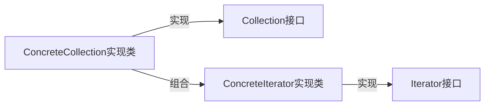

# 迭代器模式

> 状态模式是状态机的一种实现方法。它通过将事件触发的状态转移和动作执行，拆分到不同的状态类中，以此来避免状态机类中的分支判断逻辑，应对状态机类代码的复杂性。

迭代器模式，它用来遍历集合对象。不过，很多编程语言都将迭代器作为一个基础的类库，直接提供出来了。在平时开发中，特别是业务开发，我们直接使用即可，很少会自己去实现一个迭代器。不过，知其然知其所以然，弄懂原理能帮助我们更好的使用这些工具类，所以，我觉得还是有必要学习一下这个模式。

我们知道，大部分编程语言都提供了多种遍历集合的方式，比如 for 循环、foreach 循环、迭代器等。所以，今天我们除了讲解迭代器的原理和实现之外，还会重点讲一下，相对于其他遍历方式，利用迭代器来遍历集合的优势。

## 迭代器模式的原理和实现

迭代器模式（Iterator Design Pattern），也叫作游标模式（Cursor Design Pattern）。

在开篇中我们讲到，它用来遍历集合对象。这里说的“集合对象”也可以叫“容器”“聚合对象”，实际上就是包含一组对象的对象，比如数组、链表、树、图、跳表。迭代器模式将集合对象的遍历操作从集合类中拆分出来，放到迭代器类中，让两者的职责更加单一。

迭代器是用来遍历容器的，所以，一个完整的迭代器模式一般会涉及**容器**和**容器迭代器**两部分内容。为了达到基于接口而非实现编程的目的，容器又包含容器接口、容器实现类，迭代器又包含迭代器接口、迭代器实现类。对于迭代器模式，我画了一张简单的类图，你可以看一看，先有个大致的印象。



接下来，我们通过一个例子来具体讲，如何实现一个迭代器。

开篇中我们有提到，大部分编程语言都提供了遍历容器的迭代器类，我们在平时开发中，直接拿来用即可，几乎不大可能从零编写一个迭代器。不过，这里为了讲解迭代器的实现原理，我们假设某个新的编程语言的基础类库中，还没有提供线性容器对应的迭代器，需要我们从零开始开发。现在，我们一块来看具体该如何去做。

我们知道，线性数据结构包括数组和链表，在大部分编程语言中都有对应的类来封装这两种数据结构，在开发中直接拿来用就可以了。假设在这种新的编程语言中，这两个数据结构分别对应 ArrayList 和 LinkedList 两个类。除此之外，我们从两个类中抽象出公共的接口，定义为 List 接口，以方便开发者基于接口而非实现编程，编写的代码能在两种数据存储结构之间灵活切换。

现在，我们针对 ArrayList 和 LinkedList 两个线性容器，设计实现对应的迭代器。按照之前给出的迭代器模式的类图，我们定义一个迭代器接口 Iterator，以及针对两种容器的具体的迭代器实现类 ArrayIterator 和 ListIterator。

我们先来看下 Iterator 接口的定义。具体的代码如下所示：

```java
// 接口定义方式一
public interface Iterator<E> {
  boolean hasNext();
  void next();
  E currentItem();
}

// 接口定义方式二
public interface Iterator<E> {
  boolean hasNext();
  E next();
}
```

Iterator 接口有两种定义方式。

在第一种定义中，next() 函数用来将游标后移一位元素，currentItem() 函数用来返回当前游标指向的元素。在第二种定义中，返回当前元素与后移一位这两个操作，要放到同一个函数 next() 中完成。

第一种定义方式更加灵活一些，比如我们可以多次调用 currentItem() 查询当前元素，而不移动游标。所以，在接下来的实现中，我们选择第一种接口定义方式。

现在，我们再来看下 ArrayIterator 的代码实现，具体如下所示。代码实现非常简单，不需要太多解释。你可以结合着我给出的 demo，自己理解一下。

```java
public class ArrayIterator<E> implements Iterator<E> {
  private int cursor;
  private ArrayList<E> arrayList;
    
  public ArrayIterator(ArrayList<E> arrayList) {
    this.cursor = 0;
    this.arrayList = arrayList;
  }
    
  @Override
  public boolean hasNext() {
    return cursor != arrayList.size(); //注意这里，cursor在指向最后一个元素的时候，hasNext()仍旧返回true。
  }
    
  @Override
  public void next() {
    cursor++;
  }
    
  @Override
  public E currentItem() {
    if (cursor >= arrayList.size()) {
      throw new NoSuchElementException();
    }
    return arrayList.get(cursor);
  }
}

public class Demo {
  public static void main(String[] args) {
    ArrayList<String> names = new ArrayList<>();
    names.add("xzg");
    names.add("wang");
    names.add("zheng");
    
    Iterator<String> iterator = new ArrayIterator(names);
    while (iterator.hasNext()) {
      System.out.println(iterator.currentItem());
      iterator.next();
    }
  }
}
```

在上面的代码实现中，我们需要将待遍历的容器对象，通过构造函数传递给迭代器类。实际上，为了封装迭代器的创建细节，我们可以在容器中定义一个 iterator() 方法，来创建对应的迭代器。为了能实现基于接口而非实现编程，我们还需要将这个方法定义在 List 接口中。具体的代码实现和使用示例如下所示：

```java
public interface List<E> {
  Iterator iterator();
  //...省略其他接口函数...
}

public class ArrayList<E> implements List<E> {
  //...
  public Iterator iterator() {
    return new ArrayIterator(this);
  }
  //...省略其他代码
}

public class Demo {
  public static void main(String[] args) {
    List<String> names = new ArrayList<>();
    names.add("xzg");
    names.add("wang");
    names.add("zheng");
    
    Iterator<String> iterator = names.iterator();
    while (iterator.hasNext()) {
      System.out.println(iterator.currentItem());
      iterator.next();
    }
  }
}
```

对于 LinkedIterator，它的代码结构跟 ArrayIterator 完全相同，我这里就不给出具体的代码实现了，你可以参照 ArrayIterator 自己去写一下。

结合刚刚的例子，我们来总结一下迭代器的设计思路。总结下来就三句话：迭代器中需要定义 hasNext()、currentItem()、next() 三个最基本的方法。待遍历的容器对象通过依赖注入传递到迭代器类中。容器通过 iterator() 方法来创建迭代器。

这里我画了一张类图，如下所示。实际上就是对上面那张类图的细化，你可以结合着一块看。


## 迭代器模式的优势

迭代器的原理和代码实现讲完了。接下来，我们来一块看一下，使用迭代器遍历集合的优势。

一般来讲，遍历集合数据有三种方法：for 循环、foreach 循环、iterator 迭代器。对于这三种方式，我拿 Java 语言来举例说明一下。具体的代码如下所示：

```java
List<String> names = new ArrayList<>();
names.add("xzg");
names.add("wang");
names.add("zheng");
// 第一种遍历方式：for循环
for (int i = 0; i < names.size(); i++) {
  System.out.print(names.get(i) + ",");
}
// 第二种遍历方式：foreach循环
for (String name : names) {
  System.out.print(name + ",")
}
// 第三种遍历方式：迭代器遍历
Iterator<String> iterator = names.iterator();
while (iterator.hasNext()) {
  System.out.print(iterator.next() + ",");//Java中的迭代器接口是第二种定义方式，next()既移动游标又返回数据
}
```

实际上，foreach 循环只是一个语法糖而已，底层是基于迭代器来实现的。也就是说，上面代码中的第二种遍历方式（foreach 循环代码）的底层实现，就是第三种遍历方式（迭代器遍历代码）。这两种遍历方式可以看作同一种遍历方式，也就是迭代器遍历方式。

从上面的代码来看，for 循环遍历方式比起迭代器遍历方式，代码看起来更加简洁。那我们为什么还要用迭代器来遍历容器呢？为什么还要给容器设计对应的迭代器呢？原因有以下三个。

首先，对于类似数组和链表这样的数据结构，遍历方式比较简单，直接使用 for 循环来遍历就足够了。但是，对于复杂的数据结构（比如树、图）来说，有各种复杂的遍历方式。比如，树有前中后序、按层遍历，图有深度优先、广度优先遍历等等。如果由客户端代码来实现这些遍历算法，势必增加开发成本，而且容易写错。如果将这部分遍历的逻辑写到容器类中，也会导致容器类代码的复杂性。

前面也多次提到，应对复杂性的方法就是拆分。我们可以将遍历操作拆分到迭代器类中。比如，针对图的遍历，我们就可以定义 DFSIterator、BFSIterator 两个迭代器类，让它们分别来实现深度优先遍历和广度优先遍历。

其次，将游标指向的当前位置等信息，存储在迭代器类中，每个迭代器独享游标信息。这样，我们就可以创建多个不同的迭代器，同时对同一个容器进行遍历而互不影响。

最后，容器和迭代器都提供了抽象的接口，方便我们在开发的时候，基于接口而非具体的实现编程。当需要切换新的遍历算法的时候，比如，从前往后遍历链表切换成从后往前遍历链表，客户端代码只需要将迭代器类从 LinkedIterator 切换为 ReversedLinkedIterator 即可，其他代码都不需要修改。除此之外，添加新的遍历算法，我们只需要扩展新的迭代器类，也更符合开闭原则。

## 在遍历的同时增删集合元素会发生什么？

之前，我们通过给 ArrayList、LinkedList 容器实现迭代器，学习了迭代器模式的原理、实现和设计意图。迭代器模式主要作用是解耦容器代码和遍历代码，这也印证了我们前面多次讲过的应用设计模式的主要目的是解耦。

上一节课中讲解的内容都比较基础，再来深挖一下，如果在使用迭代器遍历集合的同时增加、删除集合中的元素，会发生什么情况？应该如何应对？如何在遍历的同时安全地删除集合元素？

在通过迭代器来遍历集合元素的同时，增加或者删除集合中的元素，有可能会导致某个元素被重复遍历或遍历不到。不过，并不是所有情况下都会遍历出错，有的时候也可以正常遍历，所以，这种行为称为**结果不可预期行为**或者**未决行为**，也就是说，运行结果到底是对还是错，要视情况而定。

怎么理解呢？我们通过一个例子来解释一下。我们还是延续上一节课实现的 ArrayList 迭代器的例子。为了方便你查看，我把相关的代码都重新拷贝到这里了。

```java
public interface Iterator<E> {
  boolean hasNext();
  void next();
  E currentItem();
}

public class ArrayIterator<E> implements Iterator<E> {
  private int cursor;
  private ArrayList<E> arrayList;
    
  public ArrayIterator(ArrayList<E> arrayList) {
    this.cursor = 0;
    this.arrayList = arrayList;
  }
    
  @Override
  public boolean hasNext() {
    return cursor < arrayList.size();
  }
    
  @Override
  public void next() {
    cursor++;
  }
    
  @Override
  public E currentItem() {
    if (cursor >= arrayList.size()) {
      throw new NoSuchElementException();
    }
    return arrayList.get(cursor);
  }
}

public interface List<E> {
  Iterator iterator();
}

public class ArrayList<E> implements List<E> {
  //...
  public Iterator iterator() {
    return new ArrayIterator(this);
  }
  //...
}

public class Demo {
  public static void main(String[] args) {
    List<String> names = new ArrayList<>();
    names.add("a");
    names.add("b");
    names.add("c");
    names.add("d");
    Iterator<String> iterator = names.iterator();
    iterator.next();
    names.remove("a");
  }
}
```

我们知道，ArrayList 底层对应的是数组这种数据结构，在执行完第 55 行代码的时候，数组中存储的是 a、b、c、d 四个元素，迭代器的游标 cursor 指向元素 a。当执行完第 56 行代码的时候，游标指向元素 b，到这里都没有问题。

为了保持数组存储数据的连续性，数组的删除操作会涉及元素的搬移（详细的讲解你可以去看我的另一个专栏《数据结构与算法之美》）。当执行到第 57 行代码的时候，我们从数组中将元素 a 删除掉，b、c、d 三个元素会依次往前搬移一位，这就会导致游标本来指向元素 b，现在变成了指向元素 c。原本在执行完第 56 行代码之后，我们还可以遍历到 b、c、d 三个元素，但在执行完第 57 行代码之后，我们只能遍历到 c、d 两个元素，b 遍历不到了。

对于上面的描述，我画了一张图，你可以对照着理解。


不过，如果第 57 行代码删除的不是游标前面的元素（元素 a）以及游标所在位置的元素（元素 b），而是游标后面的元素（元素 c 和 d），这样就不会存在任何问题了，不会存在某个元素遍历不到的情况了。

所以，我们前面说，在遍历的过程中删除集合元素，结果是不可预期的，有时候没问题（删除元素 c 或 d），有时候就有问题（删除元素 a 或 b），这个要视情况而定（到底删除的是哪个位置的元素），就是这个意思。

在遍历的过程中删除集合元素，有可能会导致某个元素遍历不到，那在遍历的过程中添加集合元素，会发生什么情况呢？还是结合刚刚那个例子来讲解，我们将上面的代码稍微改造一下，把删除元素改为添加元素。具体的代码如下所示：

```java
public class Demo {
  public static void main(String[] args) {
    List<String> names = new ArrayList<>();
    names.add("a");
    names.add("b");
    names.add("c");
    names.add("d");
    Iterator<String> iterator = names.iterator();
    iterator.next();
    names.add(0, "x");
  }
}
```

在执行完第 10 行代码之后，数组中包含 a、b、c、d 四个元素，游标指向 b 这个元素，已经跳过了元素 a。在执行完第 11 行代码之后，我们将 x 插入到下标为 0 的位置，a、b、c、d 四个元素依次往后移动一位。这个时候，游标又重新指向了元素 a。元素 a 被游标重复指向两次，也就是说，元素 a 存在被重复遍历的情况。

跟删除情况类似，如果我们在游标的后面添加元素，就不会存在任何问题。所以，在遍历的同时添加集合元素也是一种不可预期行为。

同样，对于上面的添加元素的情况，我们也画了一张图，如下所示，你可以对照着理解。


## 如何应对遍历时改变集合导致的未决行为？

当通过迭代器来遍历集合的时候，增加、删除集合元素会导致不可预期的遍历结果。实际上，“不可预期”比直接出错更加可怕，有的时候运行正确，有的时候运行错误，一些隐藏很深、很难 debug 的 bug 就是这么产生的。那我们如何才能避免出现这种不可预期的运行结果呢？

有两种比较干脆利索的解决方案：一种是遍历的时候不允许增删元素，另一种是增删元素之后让遍历报错。

实际上，第一种解决方案比较难实现，我们要确定遍历开始和结束的时间点。遍历开始的时间节点我们很容易获得。我们可以把创建迭代器的时间点作为遍历开始的时间点。但是，遍历结束的时间点该如何来确定呢？

你可能会说，遍历到最后一个元素的时候就算结束呗。但是，在实际的软件开发中，每次使用迭代器来遍历元素，并不一定非要把所有元素都遍历一遍。如下所示，我们找到一个值为 b 的元素就提前结束了遍历。

```java
public class Demo {
  public static void main(String[] args) {
    List<String> names = new ArrayList<>();
    names.add("a");
    names.add("b");
    names.add("c");
    names.add("d");
      
    Iterator<String> iterator = names.iterator();
    while (iterator.hasNext()) {
      String name = iterator.currentItem();
      if (name.equals("b")) {
        break;
      }
    }
  }
}
```

你可能还会说，那我们可以在迭代器类中定义一个新的接口 finishIteration()，主动告知容器迭代器使用完了，你可以增删元素了，示例代码如下所示。但是，这就要求程序员在使用完迭代器之后要主动调用这个函数，也增加了开发成本，还很容易漏掉。

```java

public class Demo {
  public static void main(String[] args) {
    List<String> names = new ArrayList<>();
    names.add("a");
    names.add("b");
    names.add("c");
    names.add("d");
      
    Iterator<String> iterator = names.iterator();
    while (iterator.hasNext()) {
      String name = iterator.currentItem();
      if (name.equals("b")) {
        iterator.finishIteration();//主动告知容器这个迭代器用完了
        break;
      }
    }
  }
}
```

实际上，第二种解决方法更加合理。Java 语言就是采用的这种解决方案，增删元素之后，让遍历报错。接下来，我们具体来看一下如何实现。

怎么确定在遍历时候，集合有没有增删元素呢？我们在 ArrayList 中定义一个成员变量 modCount，记录集合被修改的次数，集合每调用一次增加或删除元素的函数，就会给 modCount 加 1。当通过调用集合上的 iterator() 函数来创建迭代器的时候，我们把 modCount 值传递给迭代器的 expectedModCount 成员变量，之后每次调用迭代器上的 hasNext()、next()、currentItem() 函数，我们都会检查集合上的 modCount 是否等于 expectedModCount，也就是看，在创建完迭代器之后，modCount 是否改变过。

如果两个值不相同，那就说明集合存储的元素已经改变了，要么增加了元素，要么删除了元素，之前创建的迭代器已经不能正确运行了，再继续使用就会产生不可预期的结果，所以我们选择 fail-fast 解决方式，抛出运行时异常，结束掉程序，让程序员尽快修复这个因为不正确使用迭代器而产生的 bug。

上面的描述翻译成代码就是下面这样子。你可以结合着代码一起理解我刚才的讲解。

```java
public class ArrayIterator implements Iterator {
  private int cursor;
  private ArrayList arrayList;
  private int expectedModCount;
    
  public ArrayIterator(ArrayList arrayList) {
    this.cursor = 0;
    this.arrayList = arrayList;
    this.expectedModCount = arrayList.modCount;
  }
    
  @Override
  public boolean hasNext() {
    checkForComodification();
    return cursor < arrayList.size();
  }
    
  @Override
  public void next() {
    checkForComodification();
    cursor++;
  }
    
  @Override
  public Object currentItem() {
    checkForComodification();
    return arrayList.get(cursor);
  }
  
  private void checkForComodification() {
    if (arrayList.modCount != expectedModCount)
        throw new ConcurrentModificationException();
  }
}

//代码示例
public class Demo {
  public static void main(String[] args) {
    List<String> names = new ArrayList<>();
    names.add("a");
    names.add("b");
    names.add("c");
    names.add("d");
    Iterator<String> iterator = names.iterator();
    iterator.next();
    names.remove("a");
    iterator.next();//抛出ConcurrentModificationException异常
  }
}
```

## 如何在遍历的同时安全地删除集合元素？

像 Java 语言，迭代器类中除了前面提到的几个最基本的方法之外，还定义了一个 remove() 方法，能够在遍历集合的同时，安全地删除集合中的元素。不过，需要说明的是，它并没有提供添加元素的方法。毕竟迭代器的主要作用是遍历，添加元素放到迭代器里本身就不合适。

我个人觉得，Java 迭代器中提供的 remove() 方法还是比较鸡肋的，作用有限。它只能删除游标指向的前一个元素，而且一个 next() 函数之后，只能跟着最多一个 remove() 操作，多次调用 remove() 操作会报错。我还是通过一个例子来解释一下。

```java
public class Demo {
  public static void main(String[] args) {
    List<String> names = new ArrayList<>();
    names.add("a");
    names.add("b");
    names.add("c");
    names.add("d");
      
    Iterator<String> iterator = names.iterator();
    iterator.next();
    iterator.remove();
    iterator.remove(); //报错，抛出IllegalStateException异常
  }
}
```

现在，我们一块来看下，为什么通过迭代器就能安全的删除集合中的元素呢？源码之下无秘密。我们来看下 remove() 函数是如何实现的，代码如下所示。稍微提醒一下，在 Java 实现中，迭代器类是容器类的内部类，并且 next() 函数不仅将游标后移一位，还会返回当前的元素。

```java
public class ArrayList<E> {
  transient Object[] elementData;
  private int size;
    
  public Iterator<E> iterator() {
    return new Itr();
  }
    
  private class Itr implements Iterator<E> {
    int cursor;       // index of next element to return
    int lastRet = -1; // index of last element returned; -1 if no such
    int expectedModCount = modCount;
      
    Itr() {}
      
    public boolean hasNext() {
      return cursor != size;
    }
      
    @SuppressWarnings("unchecked")
    public E next() {
      checkForComodification();
      int i = cursor;
      if (i >= size)
        throw new NoSuchElementException();
      Object[] elementData = ArrayList.this.elementData;
      if (i >= elementData.length)
        throw new ConcurrentModificationException();
      cursor = i + 1;
      return (E) elementData[lastRet = i];
    }
    
    public void remove() {
      if (lastRet < 0)
        throw new IllegalStateException();
      checkForComodification();
        
      try {
        ArrayList.this.remove(lastRet);
        cursor = lastRet;
        lastRet = -1;
        expectedModCount = modCount;
      } catch (IndexOutOfBoundsException ex) {
        throw new ConcurrentModificationException();
      }
    }
  }
}
```

在上面的代码实现中，迭代器类新增了一个 lastRet 成员变量，用来记录游标指向的前一个元素。通过迭代器去删除这个元素的时候，我们可以更新迭代器中的游标和 lastRet 值，来保证不会因为删除元素而导致某个元素遍历不到。如果通过容器来删除元素，并且希望更新迭代器中的游标值来保证遍历不出错，我们就要维护这个容器都创建了哪些迭代器，每个迭代器是否还在使用等信息，代码实现就变得比较复杂了。

## 如何实现一个支持“快照”功能的迭代器？

> 之前我们学习了迭代器模式的原理、实现，并且分析了在遍历集合的同时增删集合元素，产生不可预期结果的原因以及应对策略。

我们再来看这样一个问题：如何实现一个支持“快照”功能的迭代器？这个问题算是对上一节课内容的延伸思考，为的是帮你加深对迭代器模式的理解，也是对你分析、解决问题的一种锻炼。你可以把它当作一个面试题或者练习题，在看我的讲解之前，先试一试自己能否顺利回答上来。

我们先来介绍一下问题的背景：如何实现一个支持“快照”功能的迭代器模式？

理解这个问题最关键的是理解“快照”两个字。所谓“快照”，指我们为容器创建迭代器的时候，相当于给容器拍了一张快照（Snapshot）。之后即便我们增删容器中的元素，快照中的元素并不会做相应的改动。而迭代器遍历的对象是快照而非容器，这样就避免了在使用迭代器遍历的过程中，增删容器中的元素，导致的不可预期的结果或者报错。

接下来，我举一个例子来解释一下上面这段话。具体的代码如下所示。容器 list 中初始存储了 3、8、2 三个元素。尽管在创建迭代器 iter1 之后，容器 list 删除了元素 3，只剩下 8、2 两个元素，但是，通过 iter1 遍历的对象是快照，而非容器 list 本身。所以，遍历的结果仍然是 3、8、2。同理，iter2、iter3 也是在各自的快照上遍历，输出的结果如代码中注释所示。

```java
List<Integer> list = new ArrayList<>();
list.add(3);
list.add(8);
list.add(2);

Iterator<Integer> iter1 = list.iterator();//snapshot: 3, 8, 2
list.remove(new Integer(2));//list：3, 8
Iterator<Integer> iter2 = list.iterator();//snapshot: 3, 8
list.remove(new Integer(3));//list：8
Iterator<Integer> iter3 = list.iterator();//snapshot: 3

// 输出结果：3 8 2
while (iter1.hasNext()) {
  System.out.print(iter1.next() + " ");
}
System.out.println();

// 输出结果：3 8
while (iter2.hasNext()) {
  System.out.print(iter1.next() + " ");
}
System.out.println();

// 输出结果：8
while (iter3.hasNext()) {
  System.out.print(iter1.next() + " ");
}
System.out.println();
```

如果由你来实现上面的功能，你会如何来做呢？下面是针对这个功能需求的骨架代码，其中包含 ArrayList、SnapshotArrayIterator 两个类。对于这两个类，我只定义了必须的几个关键接口，完整的代码实现我并没有给出。你可以试着去完善一下，然后再看我下面的讲解。

```java
public ArrayList<E> implements List<E> {
  // TODO: 成员变量、私有函数等随便你定义
  
  @Override
  public void add(E obj) {
    //TODO: 由你来完善
  }
  
  @Override
  public void remove(E obj) {
    // TODO: 由你来完善
  }
  
  @Override
  public Iterator<E> iterator() {
    return new SnapshotArrayIterator(this);
  }
}
public class SnapshotArrayIterator<E> implements Iterator<E> {
  // TODO: 成员变量、私有函数等随便你定义
  
  @Override
  public boolean hasNext() {
    // TODO: 由你来完善
  }
  
  @Override
  public E next() {//返回当前元素，并且游标后移一位
    // TODO: 由你来完善
  }
}
```

### 解决方案一

我们先来看最简单的一种解决办法。在迭代器类中定义一个成员变量 snapshot 来存储快照。每当创建迭代器的时候，都拷贝一份容器中的元素到快照中，后续的遍历操作都基于这个迭代器自己持有的快照来进行。具体的代码实现如下所示：

```java
public class SnapshotArrayIterator<E> implements Iterator<E> {
  private int cursor;
  private ArrayList<E> snapshot;
    
  public SnapshotArrayIterator(ArrayList<E> arrayList) {
    this.cursor = 0;
    this.snapshot = new ArrayList<>();
    this.snapshot.addAll(arrayList);
  }
    
  @Override
  public boolean hasNext() {
    return cursor < snapshot.size();
  }
    
  @Override
  public E next() {
    E currentItem = snapshot.get(cursor);
    cursor++;
    return currentItem;
  }
}

```

这个解决方案虽然简单，但代价也有点高。每次创建迭代器的时候，都要拷贝一份数据到快照中，会增加内存的消耗。如果一个容器同时有多个迭代器在遍历元素，就会导致数据在内存中重复存储多份。不过，庆幸的是，Java 中的拷贝属于浅拷贝，也就是说，容器中的对象并非真的拷贝了多份，而只是拷贝了对象的引用而已。关于深拷贝、浅拷贝，我们在第 47 讲中有详细的讲解，你可以回过头去再看一下。

那有没有什么方法，既可以支持快照，又不需要拷贝容器呢？

### 解决方案二

我们再来看第二种解决方案。

我们可以在容器中，为每个元素保存两个时间戳，一个是添加时间戳 addTimestamp，一个是删除时间戳 delTimestamp。当元素被加入到集合中的时候，我们将 addTimestamp 设置为当前时间，将 delTimestamp 设置成最大长整型值（Long.MAX_VALUE）。当元素被删除时，我们将 delTimestamp 更新为当前时间，表示已经被删除。

注意，这里只是标记删除，而非真正将它从容器中删除。

同时，每个迭代器也保存一个迭代器创建时间戳 snapshotTimestamp，也就是迭代器对应的快照的创建时间戳。当使用迭代器来遍历容器的时候，只有满足 addTimestamp<snapshotTimestamp<delTimestamp 的元素，才是属于这个迭代器的快照。

如果元素的 addTimestamp>snapshotTimestamp，说明元素在创建了迭代器之后才加入的，不属于这个迭代器的快照；如果元素的 delTimestamp<snapshotTimestamp，说明元素在创建迭代器之前就被删除掉了，也不属于这个迭代器的快照。

这样就在不拷贝容器的情况下，在容器本身上借助时间戳实现了快照功能。具体的代码实现如下所示。注意，我们没有考虑 ArrayList 的扩容问题，感兴趣的话，你可以自己完善一下。

```java
public class ArrayList<E> implements List<E> {
  private static final int DEFAULT_CAPACITY = 10;
    
  private int actualSize; //不包含标记删除元素
  private int totalSize; //包含标记删除元素
    
  private Object[] elements;
  private long[] addTimestamps;
  private long[] delTimestamps;
    
  public ArrayList() {
    this.elements = new Object[DEFAULT_CAPACITY];
    this.addTimestamps = new long[DEFAULT_CAPACITY];
    this.delTimestamps = new long[DEFAULT_CAPACITY];
    this.totalSize = 0;
    this.actualSize = 0;
  }
    
  @Override
  public void add(E obj) {
    elements[totalSize] = obj;
    addTimestamps[totalSize] = System.currentTimeMillis();
    delTimestamps[totalSize] = Long.MAX_VALUE;
    totalSize++;
    actualSize++;
  }
    
  @Override
  public void remove(E obj) {
    for (int i = 0; i < totalSize; ++i) {
      if (elements[i].equals(obj)) {
        delTimestamps[i] = System.currentTimeMillis();
        actualSize--;
      }
    }
  }
    
  public int actualSize() {
    return this.actualSize;
  }
    
  public int totalSize() {
    return this.totalSize;
  }
    
  public E get(int i) {
    if (i >= totalSize) {
      throw new IndexOutOfBoundsException();
    }
    return (E)elements[i];
  }
    
  public long getAddTimestamp(int i) {
    if (i >= totalSize) {
      throw new IndexOutOfBoundsException();
    }
    return addTimestamps[i];
  }
    
  public long getDelTimestamp(int i) {
    if (i >= totalSize) {
      throw new IndexOutOfBoundsException();
    }
    return delTimestamps[i];
  }
}

public class SnapshotArrayIterator<E> implements Iterator<E> {
  private long snapshotTimestamp;
  private int cursorInAll; // 在整个容器中的下标，而非快照中的下标
  private int leftCount; // 快照中还有几个元素未被遍历
  private ArrayList<E> arrayList;
    
  public SnapshotArrayIterator(ArrayList<E> arrayList) {
    this.snapshotTimestamp = System.currentTimeMillis();
    this.cursorInAll = 0;
    this.leftCount = arrayList.actualSize();;
    this.arrayList = arrayList;
      
    justNext(); // 先跳到这个迭代器快照的第一个元素
  }
    
  @Override
  public boolean hasNext() {
    return this.leftCount >= 0; // 注意是>=, 而非>
  }
    
  @Override
  public E next() {
    E currentItem = arrayList.get(cursorInAll);
    justNext();
    return currentItem;
  }
    
  private void justNext() {
    while (cursorInAll < arrayList.totalSize()) {
      long addTimestamp = arrayList.getAddTimestamp(cursorInAll);
      long delTimestamp = arrayList.getDelTimestamp(cursorInAll);
      if (snapshotTimestamp > addTimestamp && snapshotTimestamp < delTimestamp) {
        leftCount--;
        break;
      }
      cursorInAll++;
    }
  }
}
```

实际上，上面的解决方案相当于解决了一个问题，又引入了另外一个问题。ArrayList 底层依赖数组这种数据结构，原本可以支持快速的随机访问，在 O(1) 时间复杂度内获取下标为 i 的元素，但现在，删除数据并非真正的删除，只是通过时间戳来标记删除，这就导致无法支持按照下标快速随机访问了。如果你对数组随机访问这块知识点不了解，可以去看我的《数据结构与算法之美》专栏，这里我就不展开讲解了。

现在，我们来看怎么解决这个问题：让容器既支持快照遍历，又支持随机访问？

解决的方法也不难，我稍微提示一下。我们可以在 ArrayList 中存储两个数组。一个支持标记删除的，用来实现快照遍历功能；一个不支持标记删除的（也就是将要删除的数据直接从数组中移除），用来支持随机访问。对应的代码我这里就不给出了，感兴趣的话你可以自己实现一下。

## 总结

迭代器模式，也叫游标模式。它用来遍历集合对象。这里说的“集合对象”，我们也可以叫“容器”“聚合对象”，实际上就是包含一组对象的对象，比如，数组、链表、树、图、跳表。

一个完整的迭代器模式，一般会涉及容器和容器迭代器两部分内容。为了达到基于接口而非实现编程的目的，容器又包含容器接口、容器实现类，迭代器又包含迭代器接口、迭代器实现类。容器中需要定义 iterator() 方法，用来创建迭代器。迭代器接口中需要定义 hasNext()、currentItem()、next() 三个最基本的方法。容器对象通过依赖注入传递到迭代器类中。

遍历集合一般有三种方式：for 循环、foreach 循环、迭代器遍历。后两种本质上属于一种，都可以看作迭代器遍历。相对于 for 循环遍历，利用迭代器来遍历有下面三个优势：

迭代器模式封装集合内部的复杂数据结构，开发者不需要了解如何遍历，直接使用容器提供的迭代器即可；

迭代器模式将集合对象的遍历操作从集合类中拆分出来，放到迭代器类中，让两者的职责更加单一；

迭代器模式让添加新的遍历算法更加容易，更符合开闭原则。除此之外，因为迭代器都实现自相同的接口，在开发中，基于接口而非实现编程，替换迭代器也变得更加容易。

-----

在通过迭代器来遍历集合元素的同时，增加或者删除集合中的元素，有可能会导致某个元素被重复遍历或遍历不到。不过，并不是所有情况下都会遍历出错，有的时候也可以正常遍历，所以，这种行为称为结果不可预期行为或者未决行为。实际上，“不可预期”比直接出错更加可怕，有的时候运行正确，有的时候运行错误，一些隐藏很深、很难 debug 的 bug 就是这么产生的。

有两种比较干脆利索的解决方案，来避免出现这种不可预期的运行结果。一种是遍历的时候不允许增删元素，另一种是增删元素之后让遍历报错。第一种解决方案比较难实现，因为很难确定迭代器使用结束的时间点。第二种解决方案更加合理。Java 语言就是采用的这种解决方案。增删元素之后，我们选择 fail-fast 解决方式，让遍历操作直接抛出运行时异常。

像 Java 语言，迭代器类中除了前面提到的几个最基本的方法之外，还定义了一个 remove() 方法，能够在遍历集合的同时，安全地删除集合中的元素。

---

今天我们讲了如何实现一个支持“快照”功能的迭代器。其实这个问题本身并不是学习的重点，因为在真实的项目开发中，我们几乎不会遇到这样的需求。所以，基于今天的内容我不想做过多的总结。我想和你说一说，为什么我要来讲今天的内容呢？

实际上，学习本节课的内容，如果你只是从前往后看一遍，看懂就觉得 ok 了，那收获几乎是零。一个好学习方法是，把它当作一个思考题或者面试题，在看我的讲解之前，自己主动思考如何解决，并且把解决方案用代码实现一遍，然后再来看跟我的讲解有哪些区别。这个过程对你分析问题、解决问题的能力的锻炼，代码设计能力、编码能力的锻炼，才是最有价值的，才是我们这篇文章的意义所在。所谓“知识是死的，能力才是活的”就是这个道理。

其实，不仅仅是这一节的内容，整个专栏的学习都是这样的。

在《数据结构与算法之美》专栏中，有同学曾经对我说，他看了很多遍我的专栏，几乎看懂了所有的内容，他觉得都掌握了，但是，在最近第一次面试中，面试官给他出了一个结合实际开发的算法题，他还是没有思路，当时脑子一片放空，问我学完这个专栏之后，要想应付算法面试，还要学哪些东西，有没有推荐的书籍。

我看了他的面试题之后发现，用我专栏里讲的知识是完全可以解决的，而且，专栏里已经讲过类似的问题，只是换了个业务背景而已。之所以他没法回答上来，还是没有将知识转化成解决问题的能力，因为他只是被动地“看”，从来没有主动地“思考”。**只掌握了知识，没锻炼能力，遇到实际的问题还是没法自己去分析、思考、解决**。

我给他的建议是，把专栏里的每个开篇问题都当做面试题，自己去思考一下，然后再看解答。这样整个专栏学下来，对能力的锻炼就多了，再遇到算法面试也就不会一点思路都没有了。同理，学习《设计模式之美》这个专栏也应该如此。

## 思考题

在 Java 中，如果在使用迭代器的同时删除容器中的元素，会导致迭代器报错，这是为什么呢？如何来解决这个问题呢？

>使用 for-each 或者 iterator 进行迭代删除 remove 时，容易导致 next() 检测的 modCount 不等于 expectedModCount 从而引发 ConcurrentModificationException。在单线程下，推荐使用 next() 得到元素，然后直接调用 remove(),注意是无参的 remove; 多线程情况下还是使用并发容器吧😃
>
>Java容器会校验修改次数`modCount`,与预期不一致就会抛出异常，这个设计是合理的：因为在使用迭代器的同时删除元素，很可能会带来数据的错误，甚至导致程序的崩溃，及时地暴露错误是正确的做法。如何解决：单线程中使用`iterator.remove()`方法删除，多线程中使用并发集合。

除了编程语言中基础类库提供的针对集合对象的迭代器之外，实际上，迭代器还有其他的应用场景，比如 MySQL ResultSet 类提供的 first()、last()、previous() 等方法，也可以看作一种迭代器，你能分析一下它的代码实现吗？

>ResultSet 内部通过维护一个类型为 ResultSetRows 的 rowData 变量来实现迭代，而 rowData 的迭代方法本质就是实现了标准库的 Iterator 接口。

基于文章中给出的 Java 迭代器的实现代码，如果一个容器对象同时创建了两个迭代器，一个迭代器调用了 remove() 方法删除了集合中的一个元素，那另一个迭代器是否还可用？或者，我换个问法，下面代码中的第 13 行的运行结果是什么？

```java
public class Demo {
  public static void main(String[] args) {
    List<String> names = new ArrayList<>();
    names.add("a");
    names.add("b");
    names.add("c");
    names.add("d");
      
    Iterator<String> iterator1 = names.iterator();
    Iterator<String> iterator2 = names.iterator();
    iterator1.next();
    iterator1.remove();
    iterator2.next(); // 运行结果？
  }
}
```

>iterator1 和 iterator2是两个不同的迭代器对象，修改一个不会影响另外一个，所以执行iterator1.remove()后，再执行iterator2.next时，会执行checkForComodification();检查，可是检查条件“arrayList.modCount != expectedModCount”中arrayList的modCount已经变成了5，而此时iterator2的expectedModCount还是4，所以触发ConcurrentModificationException异常。

LinkedList 底层基于链表，如果在遍历的同时，增加删除元素，会出现哪些不可预期的行为呢？

>LinkedList和ArrayList不同是LinkedList底层基于链表实现，增加删除元素不需要移动元素的位置，所以不会出现跟ArrayList不同的情况，比如增加元素时，不论增加的元素时在迭代器前还是后，都能通过指针寻址到下一个元素。

在今天讲的解决方案二中，删除元素只是被标记删除。被删除的元素即便在没有迭代器使用的情况下，也不会从数组中真正移除，这就会导致不必要的内存占用。针对这个问题，你有进一步优化的方法吗？

>思考题感觉像是数据库的MVCC？
>
>- 容器中维护一个每个迭代器创建时间的列表
>- 每次有迭代器创建时就在这个列表中加入自己的创建时间
>- 迭代器迭代完成后将列表中对应时间点删除
>- 清理容器时，对于容器中每个元素，如果addTime小于这个列表中的最小时间点就可以进行删除
>
>或：类似数组动态扩容和缩容，删除元素时可以比较被删除元素的总数，在被删除元素总数 < 总数的 1/2 时， 进行resize数组，清空被删除的元素，回收空间。