# 湘江以南，群山之间

> 洞庭湖仍会浩荡，湘江依然北去，张家界的群峰也会继续沉默地立在那里。
>
> 只是属于我们的这一次南下，已经永远停在了那几天。

有些旅行开始于抵达，有些旅行则开始于一列缓慢南下的火车。

这是一次从北方到南方、从城市到群山的远行，也是我们本科毕业之后，难得凑齐的一次舍友旅行。当时只顾着赶路、吃饭、爬山和拍照，并没有觉得这几天有什么特别。直到后来重新翻看照片，才发现真正被记录下来的，不只是湖南的山水，还有一段正在离我们远去的共同生活。

<!-- 封面图：全员合照，优先选择橘子洲、天门山或张家界国家森林公园的照片 -->

## 一、南下：在火车上遇见洞庭湖

我们乘坐的是硬卧。

狭窄的床铺、走廊上来往的人、泡面与热水混杂的气味，还有铁轨永不停歇的声响，共同构成了这趟旅行最朴素的开场。硬卧谈不上舒适，却很适合一群人出发：行李塞进逼仄的空隙，人挤在一节车厢里，旅程尚未真正开始，兴奋已经先一步蔓延开来。

列车一路向南，窗外的景色也在不知不觉中变化。到了华容县一带，北方的平阔已经退远，山势在窗外渐渐合拢，树木也突然丰茂起来。近处的枝叶几乎要漫过车窗，远处一排楼房灰暗地倚在山脚，隔着疾驰的列车看不见灯火，也看不见人影，像是尚未从阴翳里醒来。天空一半晦暗，一半透着微光，山林却兀自蓬勃——**不愧是湖南，连阴沉里都有压不住的绿意。**

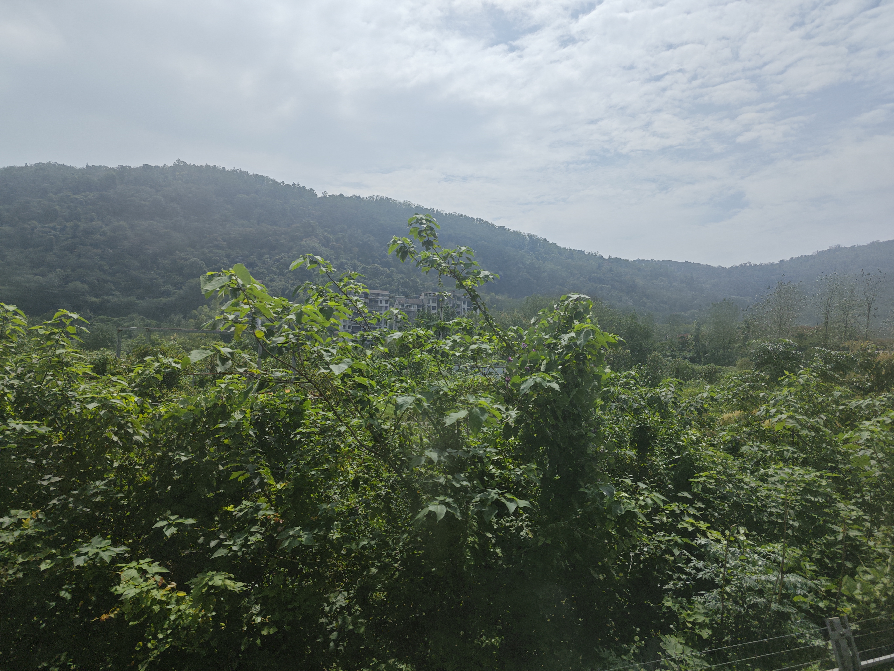

*列车经过华容县，山脚的楼房沉在阴影里，草木却已十分丰茂。*

因为火车走得不快，我们反而得以看清纬度如何一点点改变风景，看见熟悉的世界缓慢过渡成陌生的南方。

经过洞庭湖时，我们隔着车窗望向那片浩荡的水。那天湖上浮着一层淡灰色的雾，近岸的树木从车窗下方飞快掠过，远处的水面却一直铺向天边。岸线、船只和小洲渐渐淡进雾里，湖与天空几乎失去了界限。高中课本里背过无数遍的句子，也就在这时从纸面上浮了起来：

> 衔远山，吞长江，浩浩汤汤，横无际涯。
>
> ——范仲淹《岳阳楼记》

  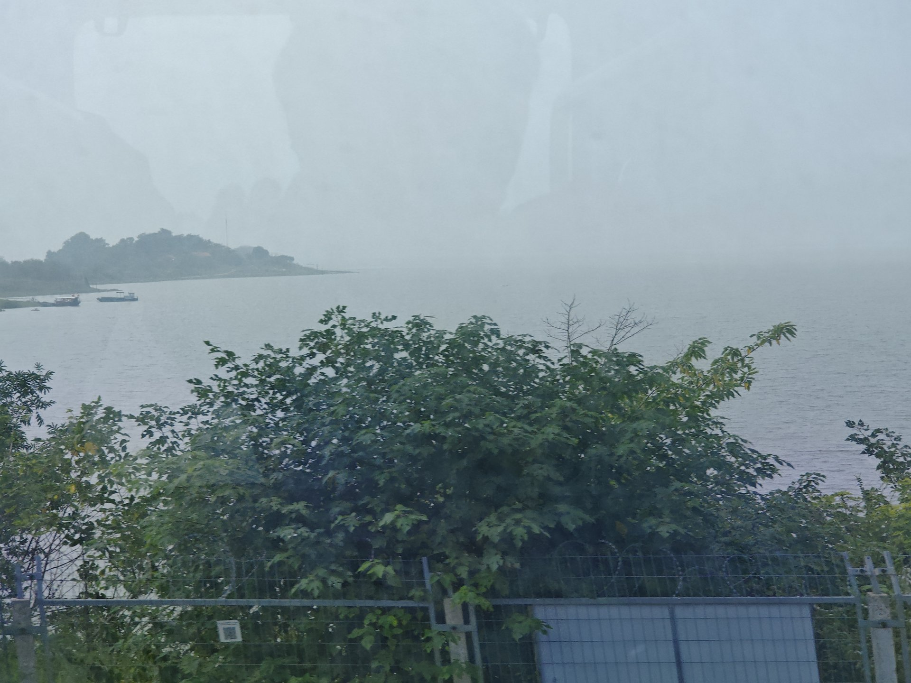
  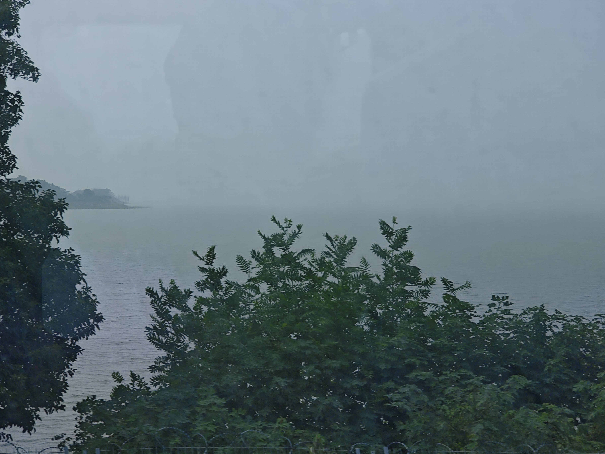

*烟波漫过水面，湖岸隐入远方——洞庭湖真如课本里写的那样。*

少年时摇头晃脑背诵的文字，在许多年后的一节火车车厢里，终于有了真实的水色与天光。原来“浩浩汤汤”不是考试时需要默写的四个字，而是隔着一层车窗，依旧望不到尽头的水面。那一刻才明白，**旅行有时也是一种迟到的阅读**。我们跋涉很远，不过是为了在某一天，亲眼见到曾经只存在于书本里的山川。

## 二、长沙：先从一顿热辣开始

抵达长沙后，这座城市给我们的第一声招呼，来自**天宝兄弟**沸腾的热气。

长途火车带来的疲惫，很快就被一桌鲜辣滚烫的食物冲散。油亮的虾浸在浓稠的汤汁里，蒜瓣、辣椒和葱花几乎把盘子铺满；另一盘炸虾高高摞起，顶上盖着一把青翠的香菜；蟹钳、小龙虾和外酥里嫩的方块也陆续摆上桌。红、亮、辣、香，长沙给我们的第一印象，就这样毫不含蓄地堆满了整张圆桌。

  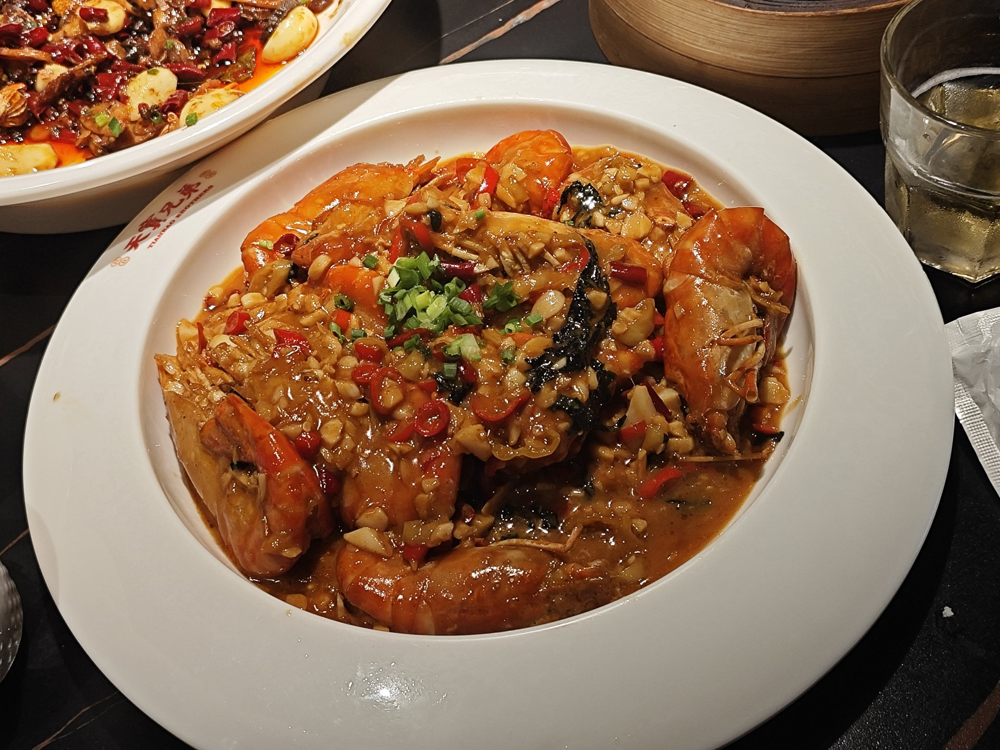
  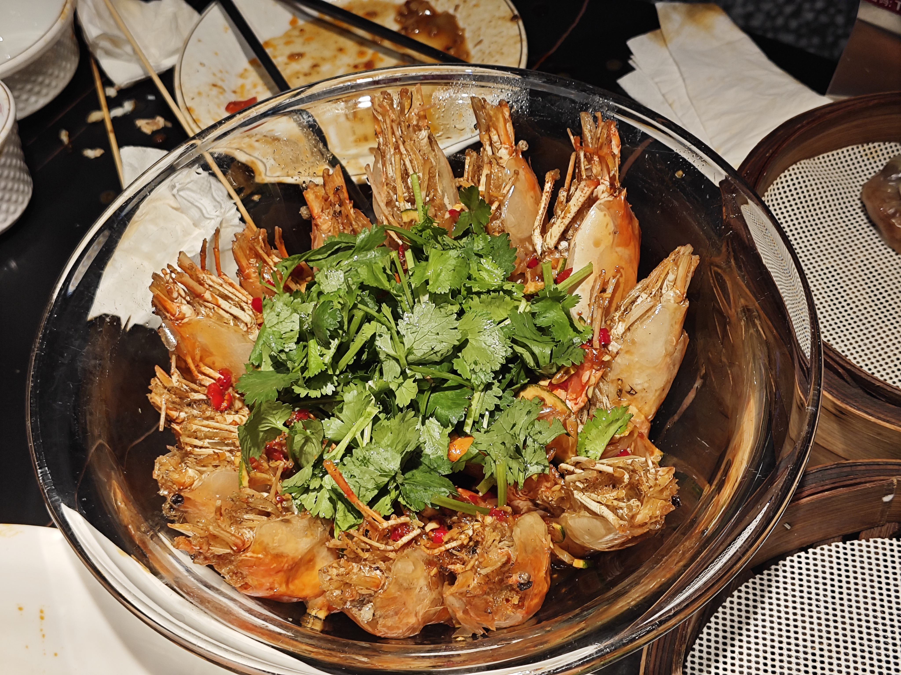
  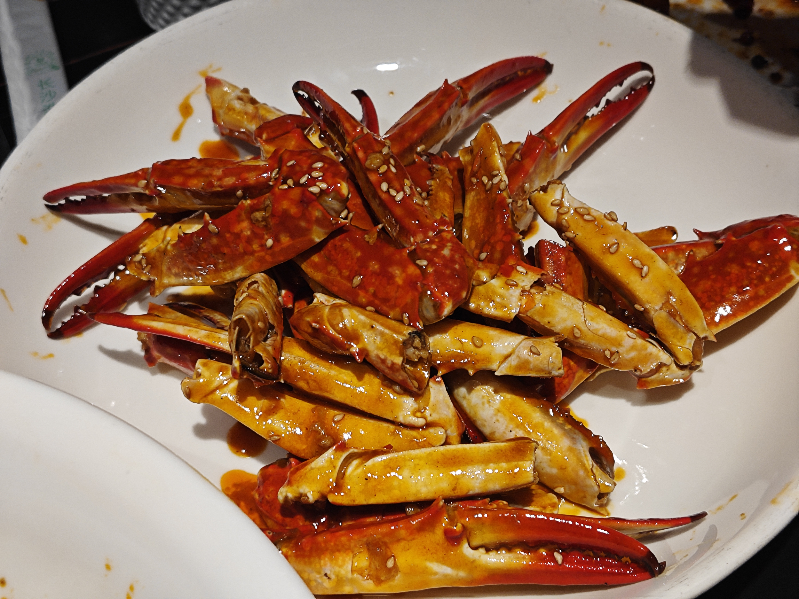
  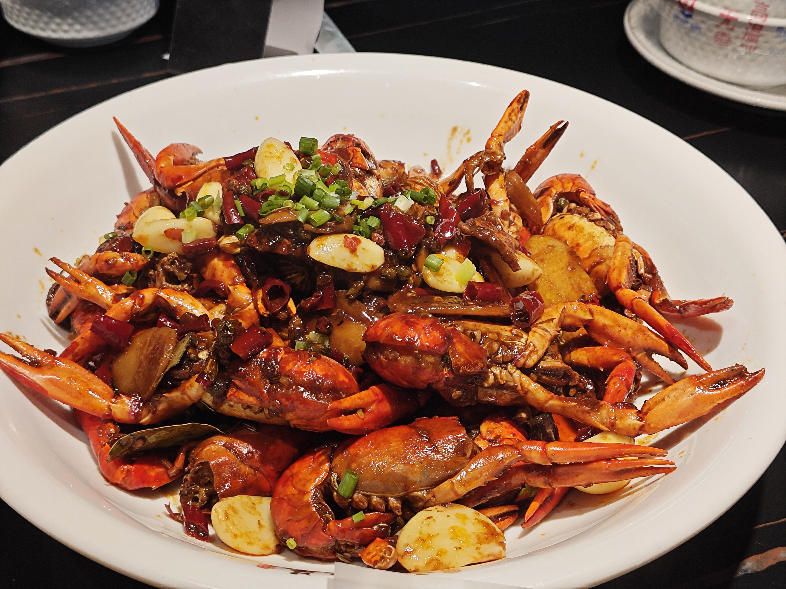
  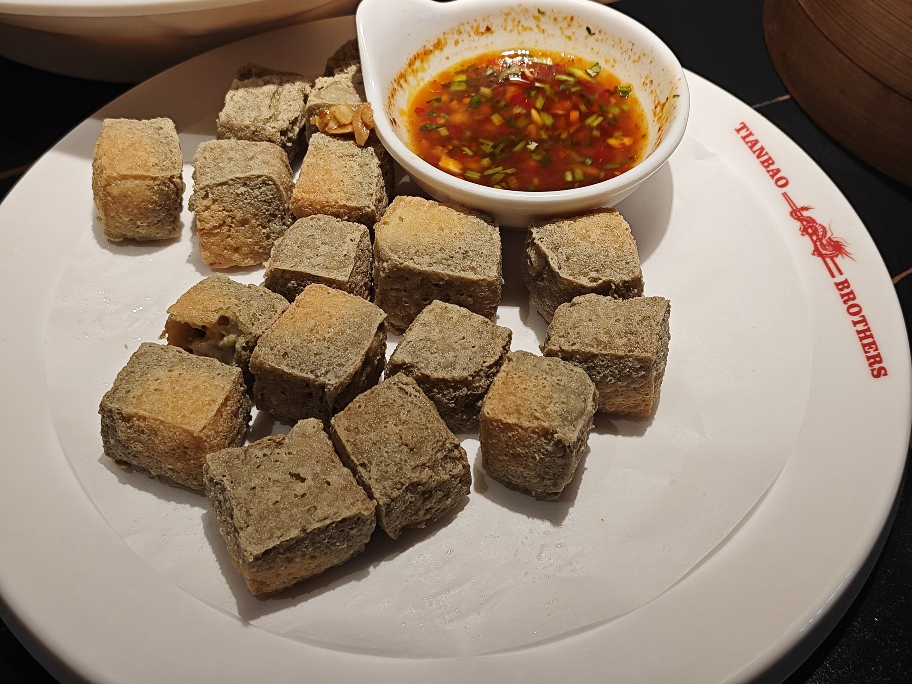

*在天宝兄弟落地长沙的第一餐：一桌鲜、香、红亮，也是一场正式开席的旅行。*

一座城市最容易被记住的，往往不是地图上的坐标，而是第一顿饭的气味。多年以后，我们未必还能说清那天经过了哪一条街，却大概仍会记得刚下火车时的饥饿，记得满桌狼藉，也记得大家坐在一起时，那种**旅程刚刚开始、时间仿佛取之不尽**的兴奋。

当然还要拍一张合照。照片里四个人依次坐在桌后，有人微笑，有人竖起拇指，有人冲镜头比着手势。桌上的杯盘还算整齐，所有人也都精神饱满——那时谁也还没有被山路、暴走和连续几天的早起折磨过。

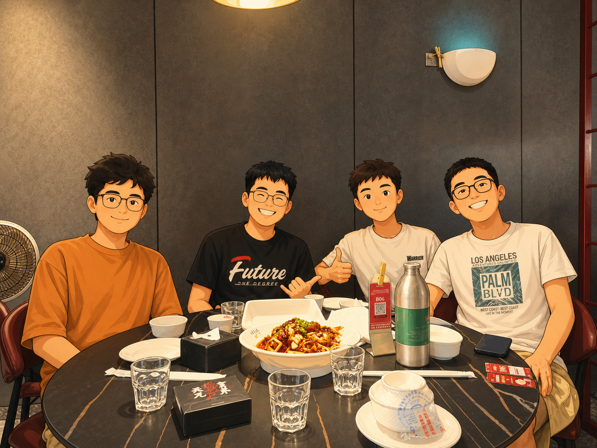

*落地长沙后的第一张合照。*

## 三、橘子洲头，湘江北去

夜里，我们去了橘子洲。

站在橘子洲上向对岸望去，长沙的CBD沿湘江一字排开。高楼的灯光在夜色里不断变换，红与蓝铺满楼身，又被江水揉成一片摇晃的倒影。白天的长沙热烈而喧闹，到了夜里，却把自己的繁华隔着一条江摆在我们面前。我们站在洲上，城市站在水的另一边，中间只剩晚风和不停流动的光。

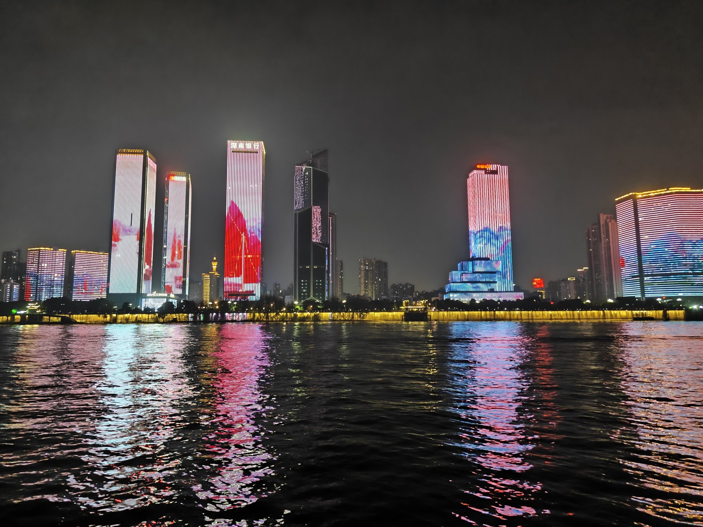

*湘江对岸灯火次第亮起，楼宇的颜色落入水中。*

在江边，我们以这片灯火为背景拍下合照。照片里的四个人站得并不十分整齐，肩膀却自然地挨在一起。身后的城市很大，楼宇很高，而那一刻，我们只是几个终于一起走到湘江边的老同学。

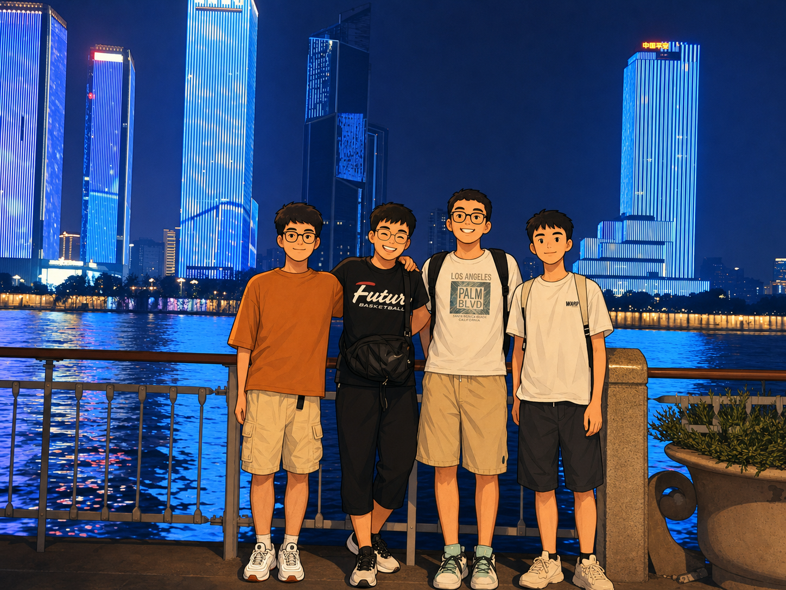

*橘子洲上的夜晚，身后是长沙的灯火。*

继续沿着洲头向前，青年毛泽东艺术雕塑从夜色里渐渐显现出来。山石般的基座与青年人的面庞连成一体，灯光从下方照上去，黑夜因此显得更深。远远望去，那张年轻的面孔越过树梢，仍旧注视着湘江与长沙。

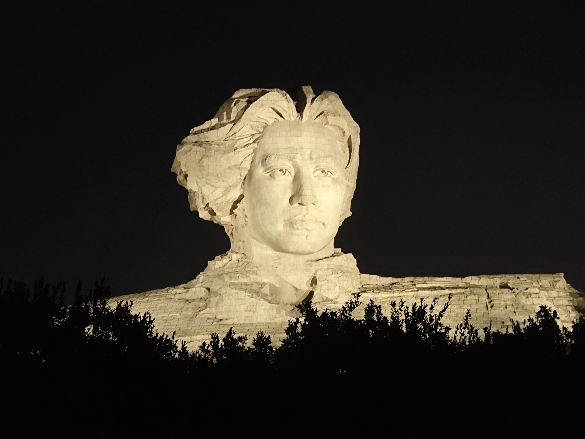

我们也在雕塑前拍了一张合照。照片里有人笑得毫无保留，有人对镜头比着手势；身后游人往来，青年毛泽东的面孔则越过人群，沉静地留在夜色中。个人的欢笑与一座城市的历史，短暂地落进了同一个取景框。

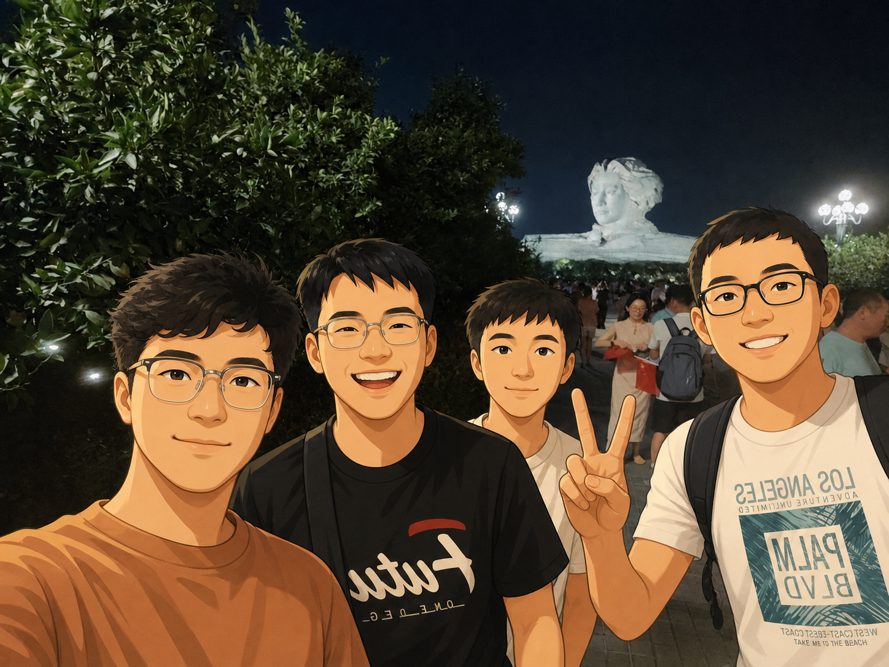

> 独立寒秋，湘江北去，橘子洲头。
>
> ——毛泽东《沁园春·长沙》

过去在课本中读到这句话，只觉得气象宏大；真正来到湘江边，才发现它首先是一个具体的秋日、一条真实的江，以及一个年轻人曾经驻足过的地方。历史并不总是遥远的，它偶尔也会在某个夜晚，以江风、灯影和一张合照的方式，与我们短暂相遇。

## 四、山下是大学，山上是长沙

第二天，我们去爬岳麓山。山脚下已经人潮涌动，入口上方“岳麓山”三个大字嵌在灰色石墙上，红旗沿着檐角迎风展开。烈日、鲜花、举着遮阳伞的游客和青瓦红柱叠在一起，长沙明亮的白昼就这样开始了。

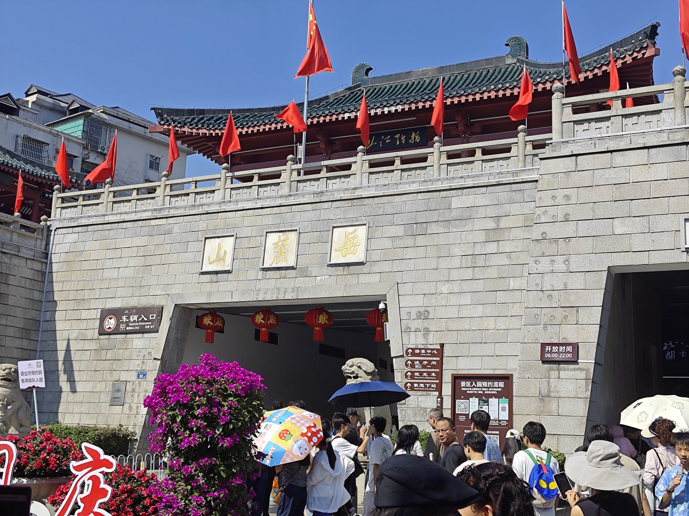

既然说是爬山，便没有用更轻松的方式敷衍过去。大家从山脚一路向上，刚开始还有闲情聊天拍照，后来话越来越少，喘气声越来越明显。谁走在最前面，谁又落在最后；谁嘴上说着“不行了”，却始终没有真正停下来——这些细节，现在看来或许比山顶的风景更值得怀念。

登高之后再回望长沙，城市从脚下铺展开来。近处是岳麓山浓密的树冠，再往外是湖南大学的楼房与操场；湘江横在城市中间，橘子洲像一叶狭长的绿舟浮在水上，江对岸则是昨夜还闪着霓虹的高楼。到了白天，那些楼宇褪去灯光，只在薄雾中显出密密的轮廓。

  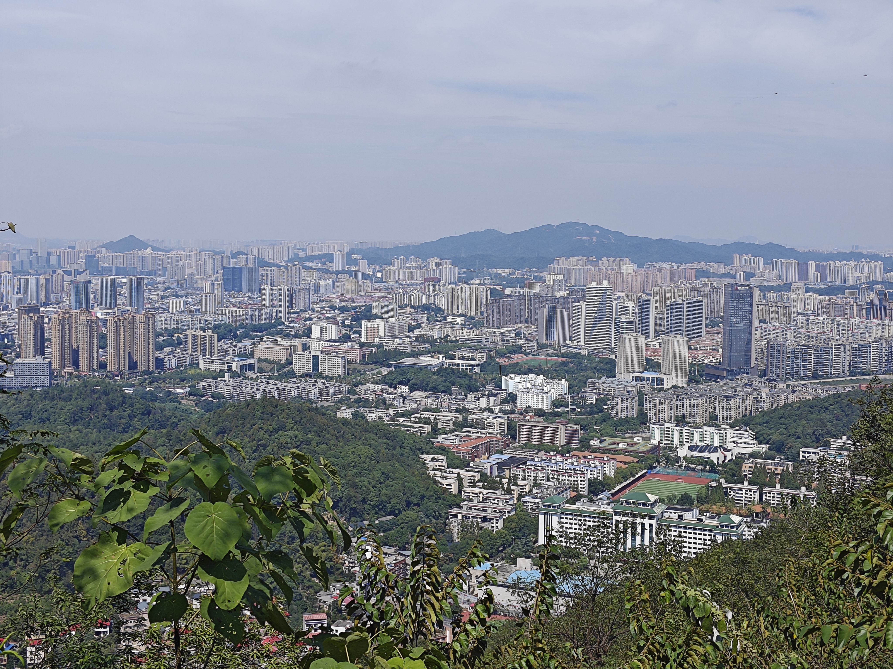
  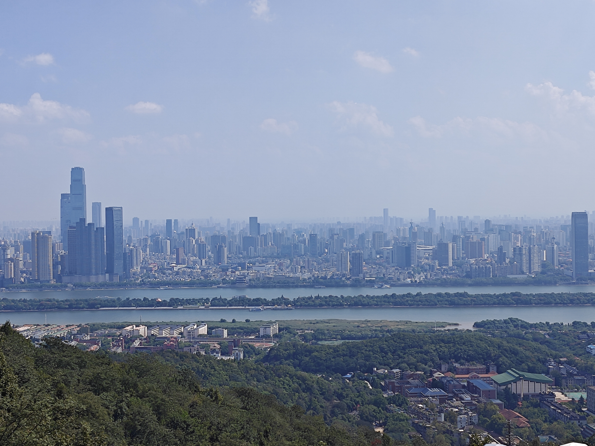

*昨夜我们站在江中看城市，今天又从山上越过湘江看它。*

我们在山顶拍了合照，努力把眼前所见和当时的自己一并留住。照片里的背景很开阔，四个人却把画面挤得满满当当。后来再看，会觉得所谓登顶的意义，未必只是看到了多远的风景，也是终于可以站在一起说一句：这段路，我们确实走上来了。

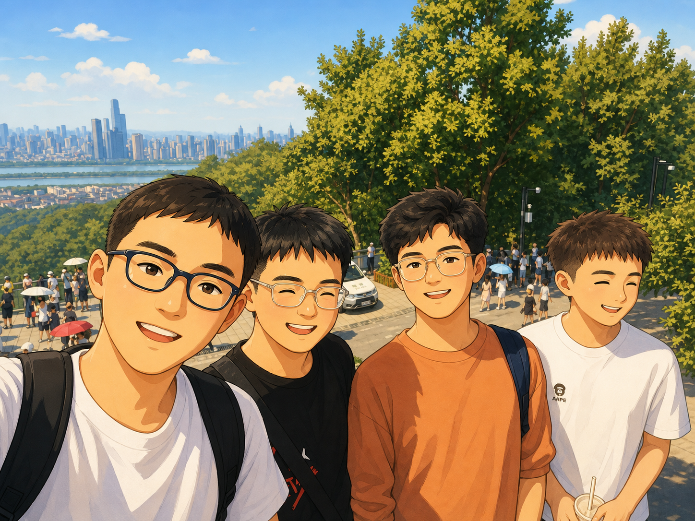

### 书院深处

从山上下来，我们走进岳麓书院。院中有一株古树，树干粗壮而斑驳，枝桠向四面伸展，几乎撑起了头顶的一整片天空。阳光从叶隙间落下来，照亮竹林、青瓦和来往的人。与山顶开阔的城市不同，书院里的时间像被树荫收拢了，脚步也不由得慢下来。

  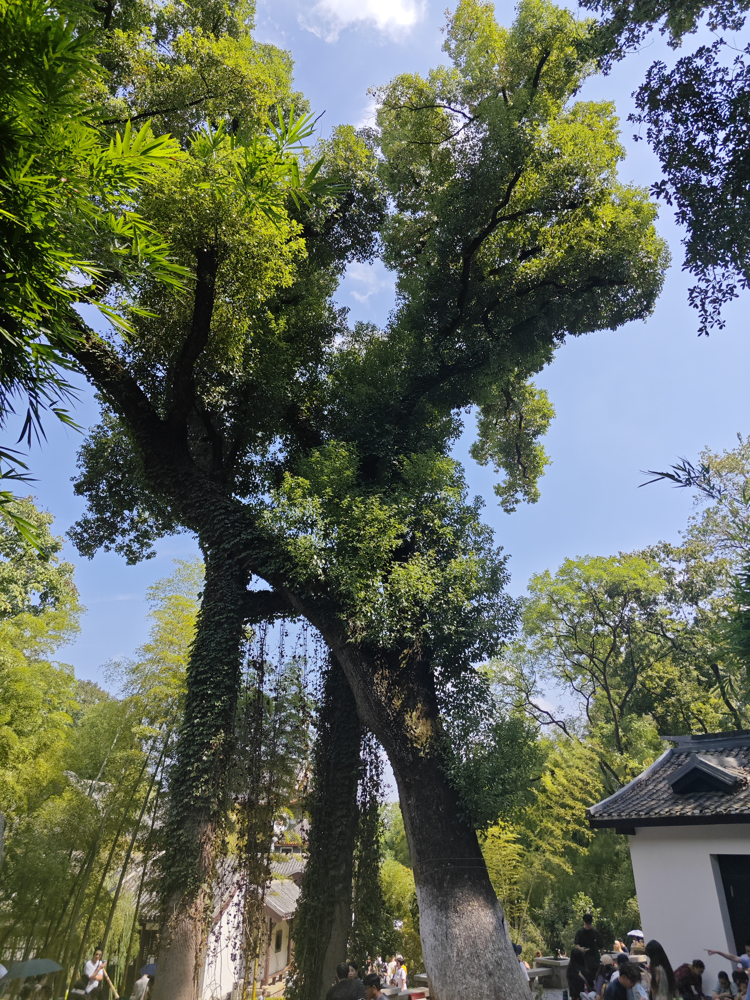

*古树的枝叶越过屋檐，替书院遮住了大半日光。*

我们还拍下了一整面端正的楷书。整理照片时才看清，右上题着五个字：**《岳麓书院记》**。

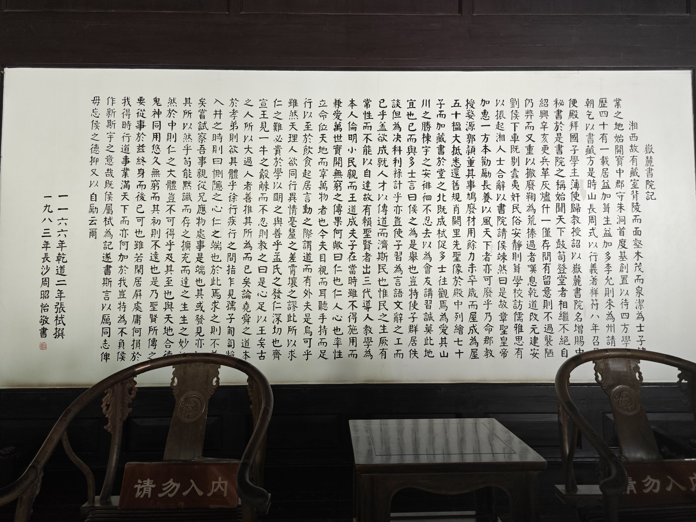

这是南宋理学家张栻为岳麓书院所作的记文，写于乾道二年，也就是1166年；照片左下的落款则说明，我们眼前这一版由长沙周昭怡于1983年敬书。文章前半追述书院兴废，后半却把话题落到了“为何而学”上：书院不应只教人追逐功名，也不应只训练辞章，而应当成就真正的人才。

> 盖欲成就人才，以传道而济斯民也。
>
> ——张栻[《岳麓书院记》](https://www.gushiwen.cn/shiwenv.aspx?id=cf783f084afe)

八百多年前写下的文字，就这样留在书院的一面墙上。我们当时匆匆拍下，甚至不知道它是什么；直到旅行结束以后重新辨认，才算真正读到。**有些风景是在现场看见的，有些风景却要回到生活以后，才慢慢显影。**

走出书院后，我们从湖南大学出来。山林忽然接上了校园，岳麓山的树影、书院的旧意和年轻学生的身影交织在一起：一边是千年文脉，一边是仍在继续的青春。

> 惟楚有材，于斯为盛。

过去读来像一句典故，走到这里才发现，它也可以是一种日常。只是对已经逐渐走出校园的我们而言，再经过一所大学，总会忍不住多看几眼。

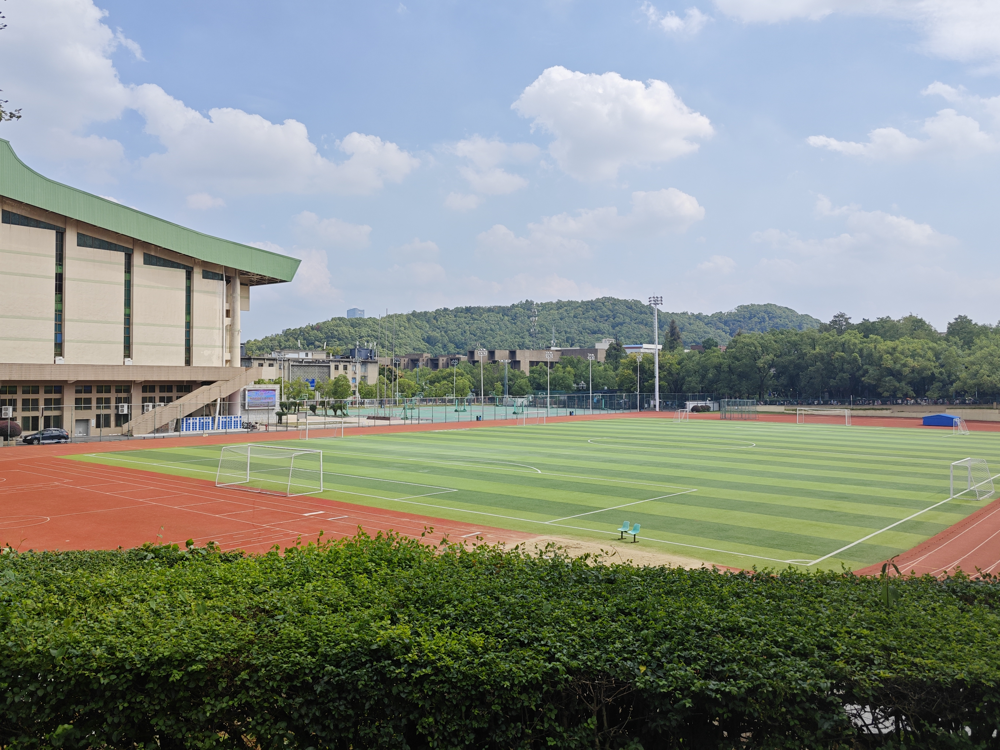

操场安静地躺在蓝天与岳麓山之间，球门、跑道和看台都再普通不过。可对于已经离开本科校园的我们来说，这种普通反而最容易令人恍惚：仿佛只要沿着跑道再走几步，就还能回到那些推开宿舍门便能见到彼此的日子。

## 五、人间烟火，在长沙的街巷里

从岳麓山回来，我们又扎进步行街的人潮。

**臭豆腐当然要吃，茶颜悦色当然要喝，古德莫宁也不能落下。**旅行中的胃似乎拥有另一套规则：刚吃完不久，只要看见没尝过的东西，便还能再腾出一点位置。

臭豆腐的气味霸道得不讲道理。黑得发亮的方块浸在汤汁里，辣椒、蒜末和葱花浮在上面，竹签一扎，外壳先脆响一下，里面却仍是滚烫而柔软的。它的气味像是在劝退，味道却在挽留——长沙大概很懂这种先声夺人的表达。

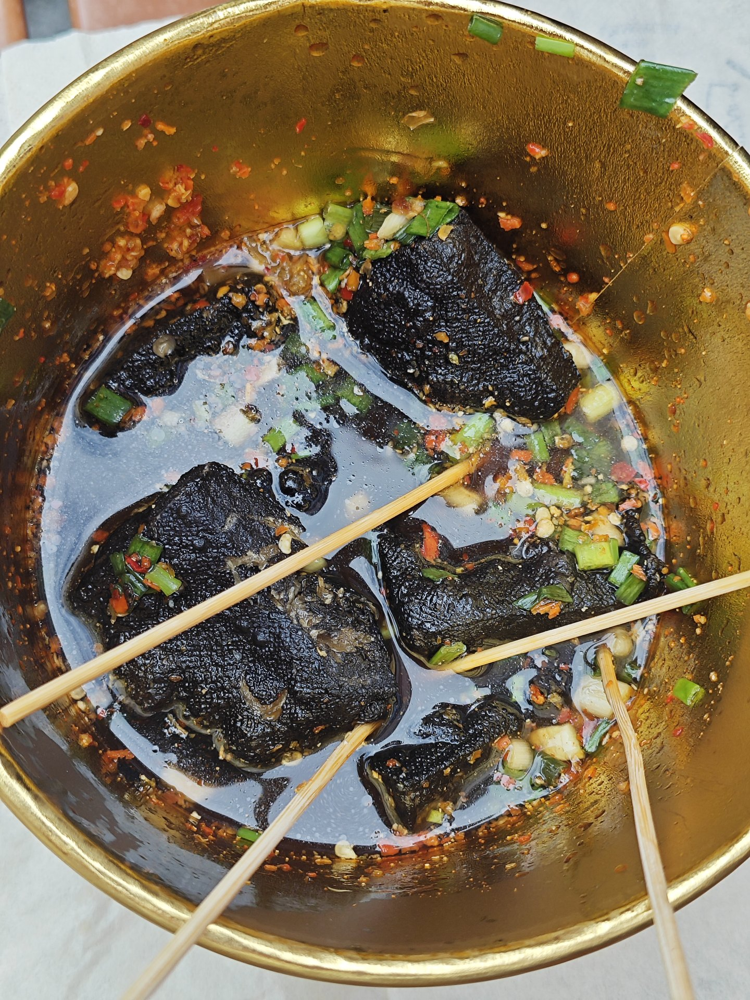

有人吃得豪迈，也有人吃出了几分命运多舛的气质：蹲在街边，抱着背包，面前只剩半碗臭豆腐，眼神越过熙攘的人群，像是在思考人生将把自己带向何方。于是这张照片很快拥有了自己的“新闻标题”。

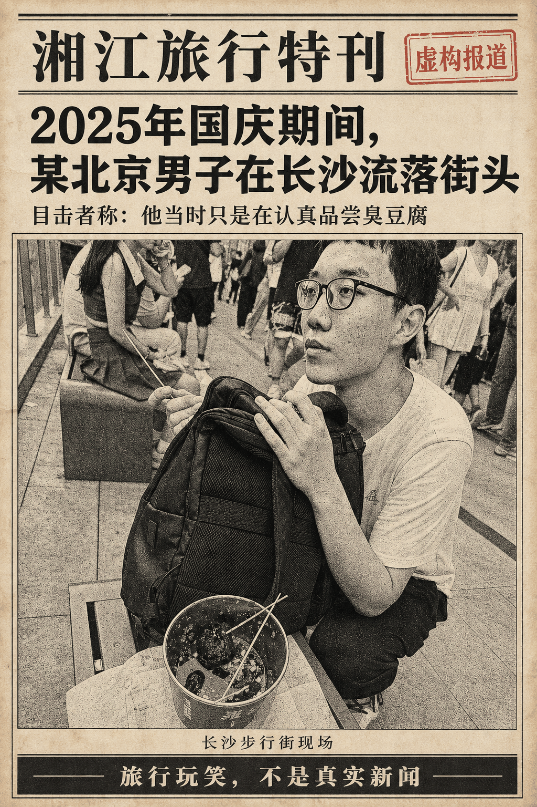

当然，所谓“流落街头”纯属舍友之间的玩笑。真实情况不过是：**国庆的长沙人太多，能在街边找到一小块落脚的地方，已经近乎一种幸运。**

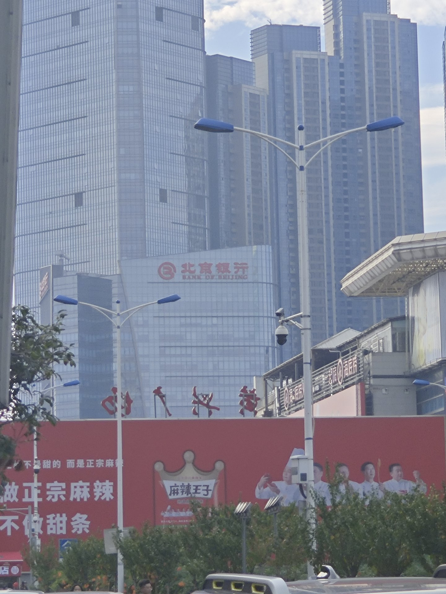

步行街是一种很奇妙的城市切片。抬头是玻璃幕墙和银行大楼，低头是麻辣、甜饮与攒动的人群；现代城市的冷峻线条，被招牌、叫卖声和一阵阵食物香气重新焐热。再往前走，一座金灿灿的门楼几乎把“热闹”两个字写在了立面上，红灯笼、花饰与国庆装点层层叠叠，恨不得让每一个路过的人都停下来拍一张。

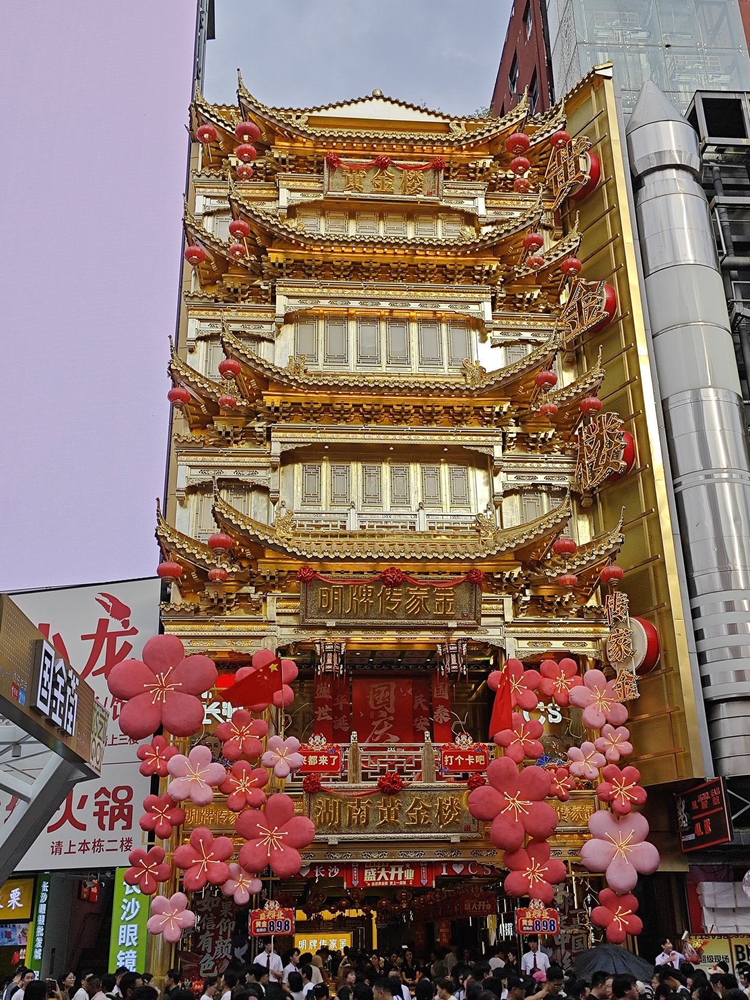

后来还吃到了一份剁椒鱼头。至于店名，暂时被我们遗失在了那天过于密集的味觉记忆里；等照片和名字补齐，再把这顿饭从记忆里好好捞回来。

<!-- 待补：剁椒鱼头照片及饭店名称 -->

茶饮的杯子在人手一个的照片里显得格外整齐。我们在人群中边走边吃，把长沙最具烟火气的一面一点点收进记忆。名胜古迹属于城市漫长的历史，而街边小吃属于我们自己的当下。

后来回忆一座城，最先想起的也许不是它的建筑，而是某个人举着杯子问：

> “你们还喝不喝？”

答案通常是：**喝。**

## 六、告别城市，进入群山

离开长沙之前，我们去了**湖南博物院**。

从步行街走进展厅，像是突然把城市的音量调低。外面的人流追着新鲜与热闹向前，玻璃展柜里的器物却只是安静地待在那里，等一个两千年之后的下午，等我们从它们面前经过。

最先让人停下脚步的，是马王堆汉墓出土的 **T 形帛画**。画面被分成天上、人间与地下三个世界，龙、凤、神怪、墓主人与送别者共同构成一套关于死亡与永生的想象。我们隔着玻璃俯身去看，那些红、黑、青白的颜色仍然鲜明。古人没有给死亡一个空白的终点，而是为它画出了一条盛大、繁复而充满秩序的去路。

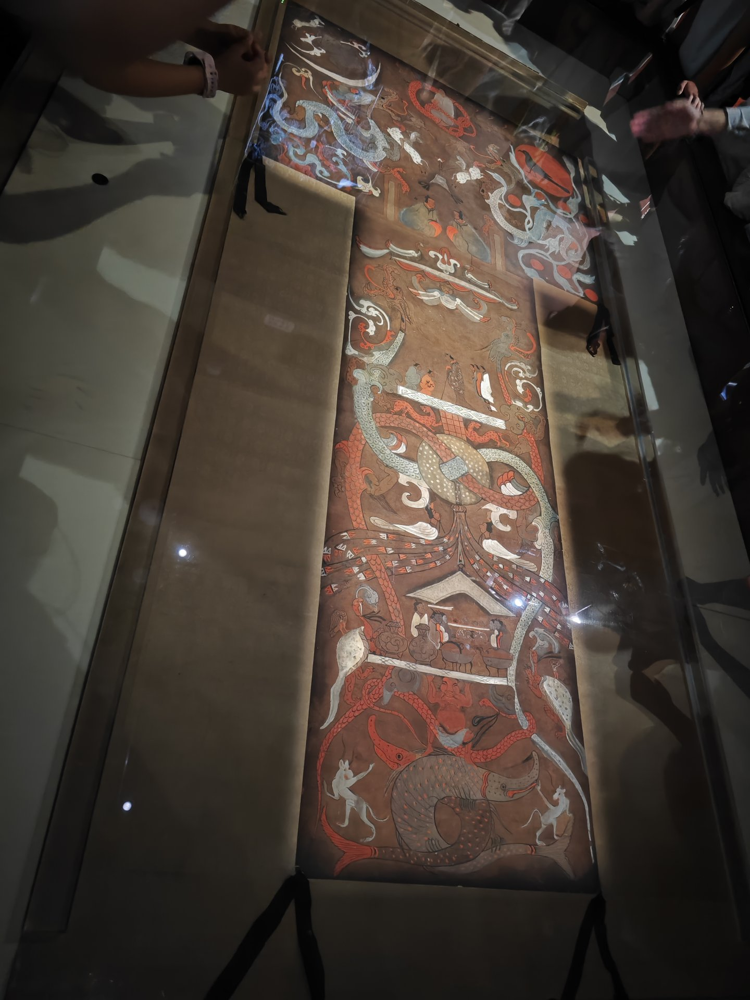

不远处的**商代豕形铜尊**则完全是另一种气质。它以野猪为形，背上开口，通身布满细密纹饰。三千多年前的人把祭祀用的酒器做得庄严，又做得生动；那头昂首站立的铜猪既像礼制中的重器，又有一种扑面而来的生命力。

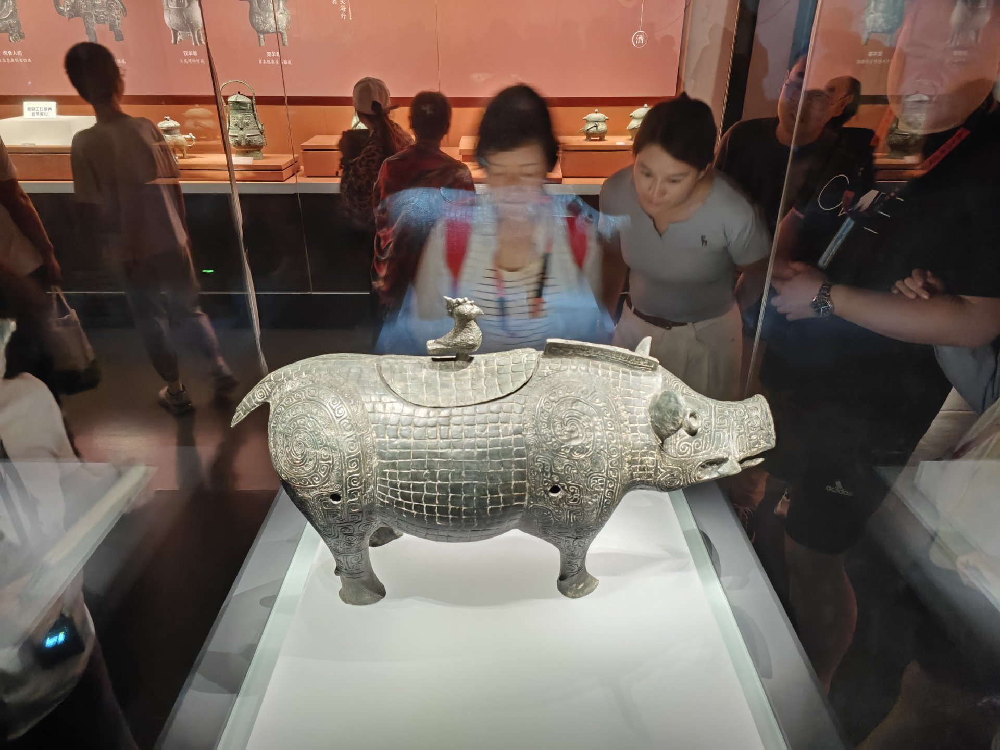

真正令人难以置信的，还是马王堆的丝织品。展柜里的衣物已经薄得近乎光影，投影标出衣领、袖口与缝合结构，提醒我们这不是一片偶然保存下来的旧布，而是一件被精心裁剪、缝制和穿着过的衣服。素纱单衣轻若烟雾，印花敷彩的丝绵袍却又层次繁复；相隔两千多年，我们仍能从经纬与针脚之间，看见汉代人的审美、技术和日常生活。

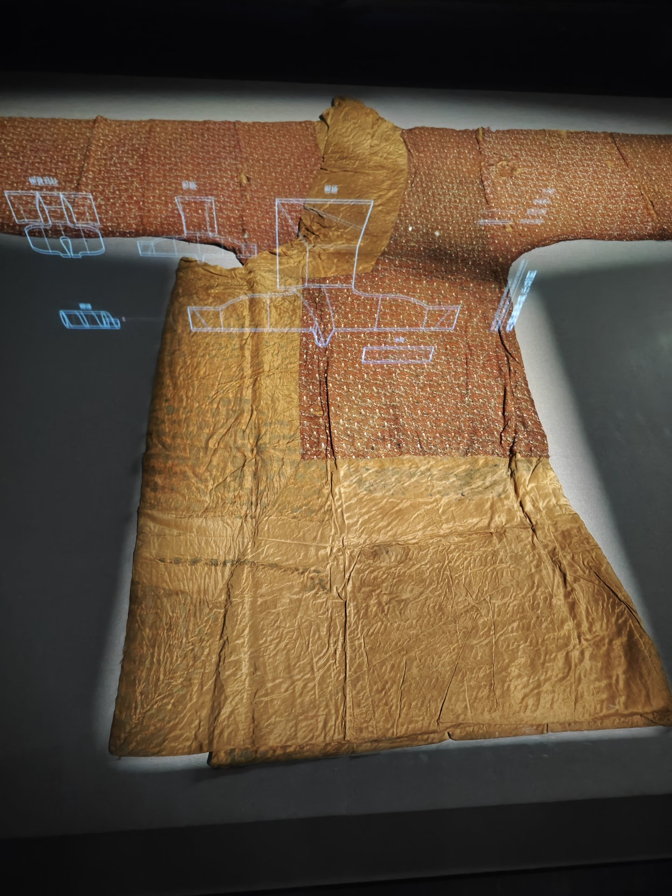

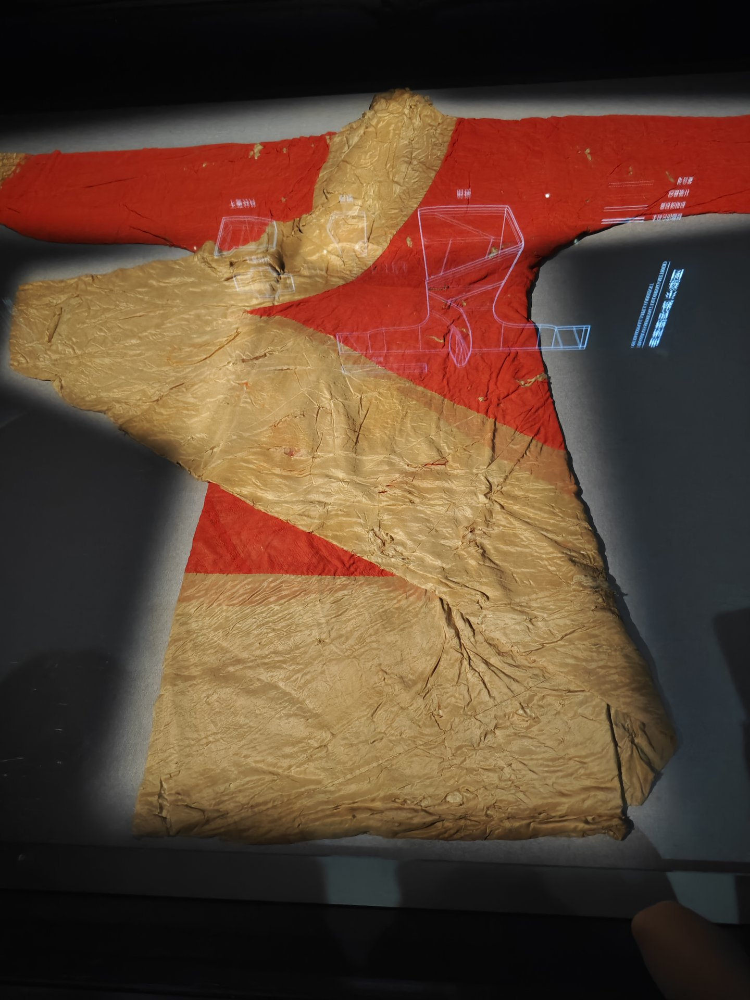

还有那幅马王堆三号墓出土的地形图。山脉以曲线层层起伏，河流在其间分岔汇合，城邑与聚落被一一标出。今天我们习惯在手机上缩放地图、计算距离，很难想象两千多年前的人已经把山川、道路与区域关系如此郑重地绘在帛上。它不是抽象的古代，而是一片曾经被行走、治理和认识过的真实土地。

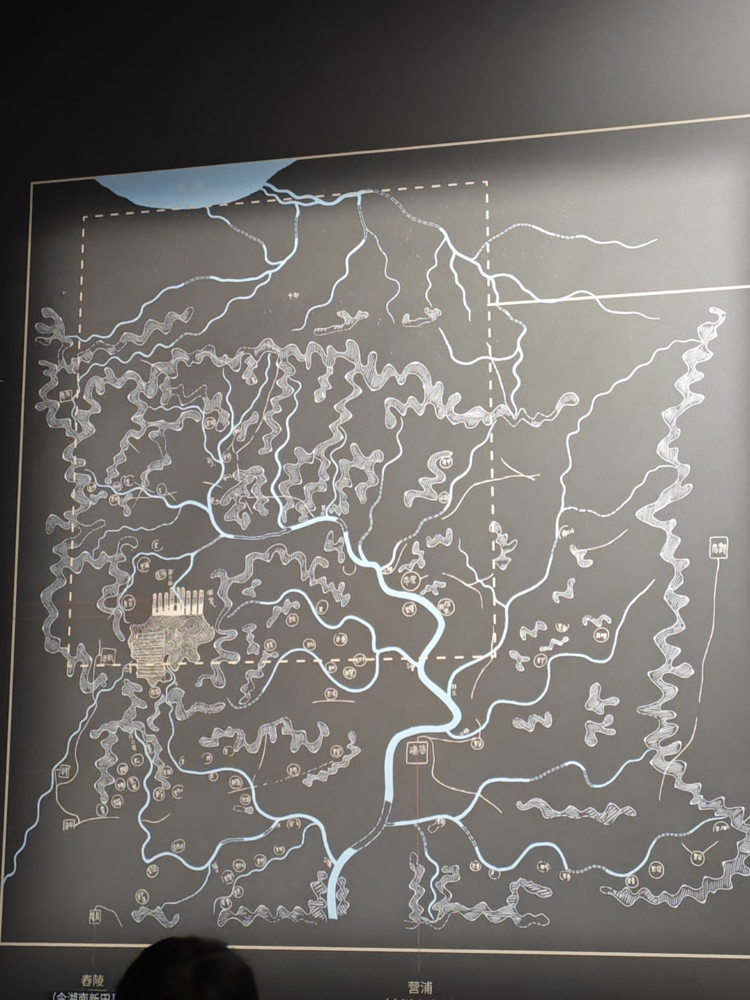

展柜里成列的青铜剑，又把时间带回楚地尚武的另一面。剑身长短不一，刃线至今仍显得利落。它们曾经属于具体的人、具体的战争与命运，如今却整齐地躺在灯光下，锋芒被历史收束成一种冷静的光。

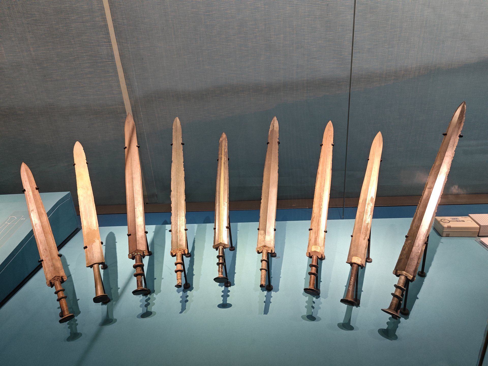

与街巷里的热闹相比，博物馆里的时间显得格外缓慢。隔着展柜望向那些从漫长岁月中保存下来的器物，会让人短暂忘记自己的行程。我们的旅行以天计算，而它们的故事以百年、千年计算。人在这样的尺度面前，总会变得安静一些。

中午，我们循着隋卞的探店推荐，去了**广殿渔村**。这个名字本就带着一点长沙式的俏皮：店最早开在广电中心附近，便取了“广电”的谐音，改作更有馆子气派的“广殿”。事实证明，旅行攻略可以不信，但一个认真研究吃饭的人给出的建议，通常值得相信。

第一道是**口味鸭脚筋**。鸭脚筋切成适口的小块，和红椒、蒜瓣、蒜苗一起大火翻炒，油亮的汤汁牢牢挂在表面；入口先是鲜辣，接着才是筋肉带来的弹韧。它几乎把湘菜的性格写在了盘子里：颜色热烈，香气直接，很难允许米饭在一旁保持完整。

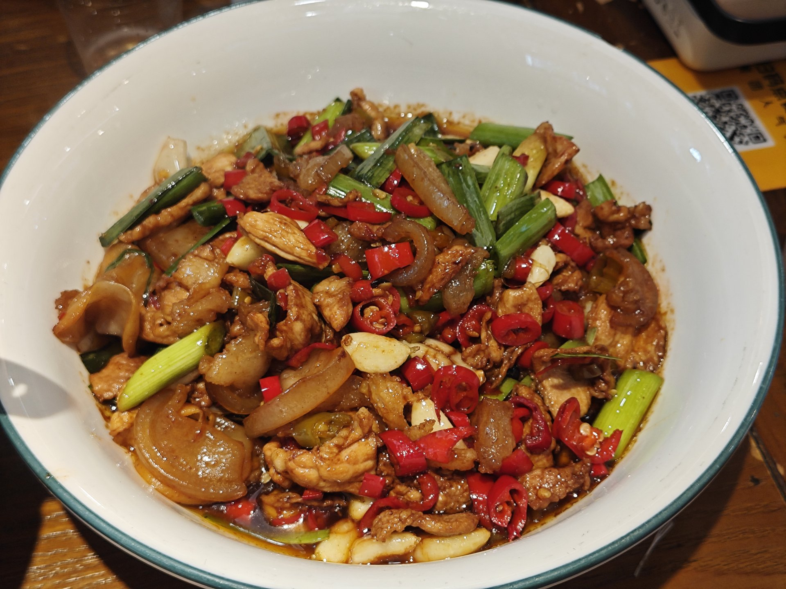

第二道是**水煮活鱼**。鱼肉浸在乳白微黄的鲜汤里，间或浮着葱段和干辣椒。名字听来朴素，上桌却很有分量；鱼肉细嫩，汤底把鲜味慢慢托起来，和前一道的猛烈辛辣恰好形成一缓一急。

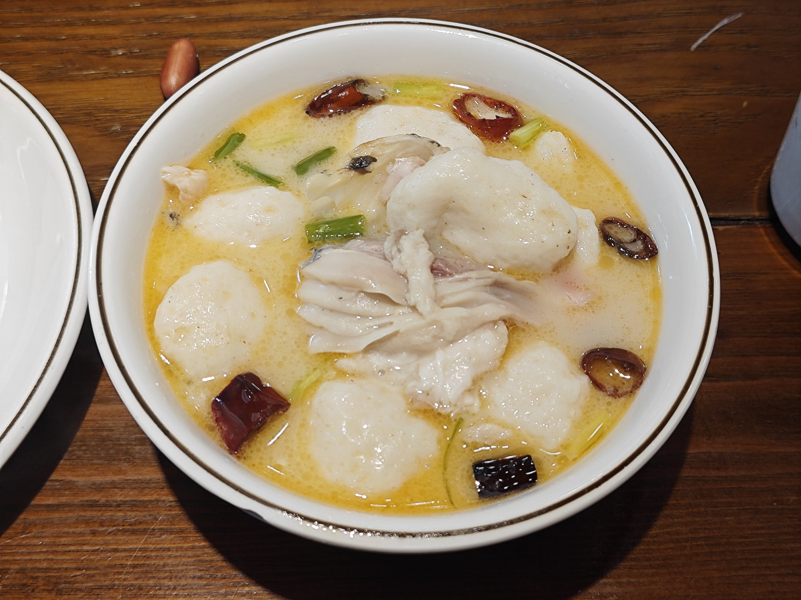

第三道是很有湖南家常意味的**烫萝卜菜肉泥**。萝卜菜被切得细碎，与肉末、蒜和辣椒一同炒香，看上去不如大鱼大肉抢眼，却格外下饭。真正留在人记忆里的地方菜，往往不是最昂贵的那一道，而是这种仿佛随时会出现在本地人饭桌上的味道。

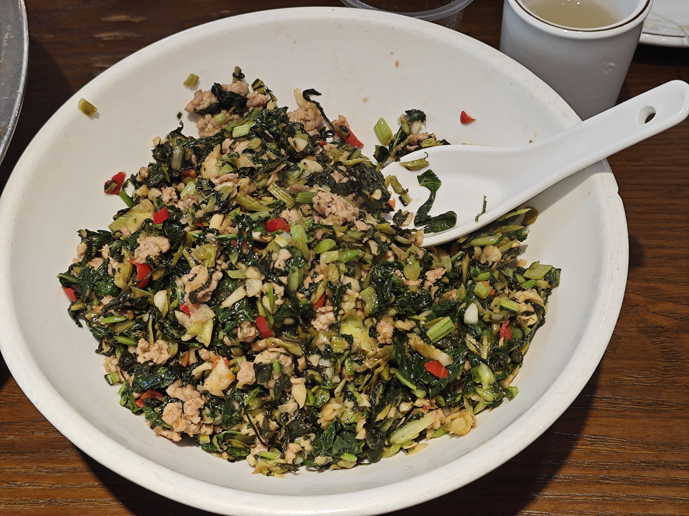

最后端上来的，是广殿渔村最出名的**招牌鱼丸**。一颗颗鱼丸浮在奶白色的鱼汤里，中间以干辣椒和葱花提色。店里的鱼丸以新鲜鱼肉手工制作，现做要等，数量也有限；可真正入口时便觉得等待值得——鱼丸紧实弹嫩，汤却柔和鲜浓。四道菜从辣到鲜、从筋骨到汤水，像把长沙午饭的声部一层层铺开，直到所有人都吃得心满意足。

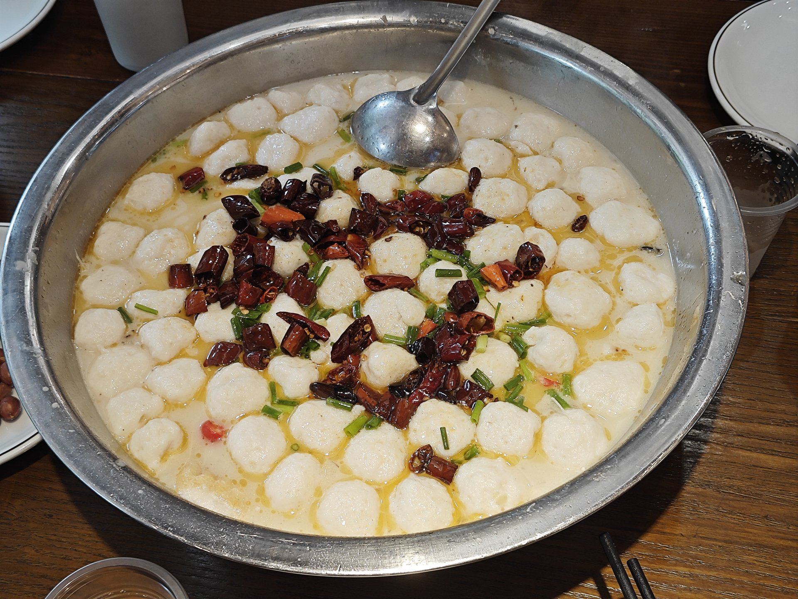

吃饱之后，我们从长沙出发前往张家界。城市的楼宇逐渐退后，窗外重新被山色占据，湖南之行也由此翻开了另一章：**长沙是热辣、拥挤而明亮的；张家界则以夜色和群山迎接我们。**

抵达后的第一顿，是土家三下锅。几个人围桌坐下，一边吃饭，一边盘算第二天的路线。那时我们尚不知道，等待我们的不仅有天门山的云雾与绝壁，还有之后金鞭溪漫长得仿佛没有尽头的路。

<!-- 待补：前往张家界途中 / 土家三下锅 -->

## 七、次日，天门洞开，人在云上

在张家界住下后的次日，我们去了天门山。

关于天门山，照片大概比语言更有说服力。群峰从云雾中升起，山路在绝壁间盘旋，眼前的景色往往还没来得及看完，转过一个弯，又是另一重天地。我们一路拍照，试图把辽阔的山色装进小小的取景框里，却总觉得镜头太窄，装不下真正站在山中时的震撼。

<!-- 图片组 10：天门山全景 / 盘山公路 / 天门洞 / 索道或栈道 -->

旅行中总有一些时刻，人会突然变得很小。

站在高处向远方望去时，城市里的烦恼、尚未完成的事情，以及那些原本以为十分重要的情绪，似乎都被群山暂时接了过去。风从山谷中升上来，云雾在脚下聚散，我们难得同时安静了一会儿。

当然，这份安静通常持续不了太久。很快就会有人招呼拍照，有人研究动作，有人嫌弃前一张没拍好。于是一群人在群山之间反复站位，把庄严的自然风光重新变回了熟悉的宿舍日常。

<!-- 图片组 11：天门山个人照 / 舍友合照 / 有趣抓拍 -->

## 八、三千奇峰，以及走不完的金鞭溪

从天门山归来，休息一晚，翌日我们走进了张家界国家森林公园。

如果说天门山让人感受到“高”，那么张家界国家森林公园更像一个由峰林构成的世界。石峰从大地上密集地生长出来，形态各异，云雾在峰与峰之间游走。眼前的风景既真实，又带着某种不真实感，仿佛走进了古画，也仿佛进入了另一个不受日常规则约束的世界。

<!-- 图片组 12：张家界峰林大景 / 云雾 / 森林步道 / 全员合照 -->

一路上，我们拍了很多照片。最初还认真选择角度，后来随着体力下降，对照片的要求逐渐变成“人都在画面里就行”。那些照片未必每一张都构图完美，却忠实记录了我们从精神抖擞到满脸疲惫的全过程。

傍晚，我们从金鞭溪一路**暴走**回酒店。

“暴走”二字，是那一天最准确的注脚。天色渐晚，溪水还在身边不紧不慢地流，脚下的路却像没有尽头。大家从谈笑风生走到沉默不语，又从沉默不语走到互相打气。山水审美逐渐让位于一个朴素的愿望：**赶紧回酒店。**

<!-- 图片组 13：金鞭溪溪水 / 暴走途中 / 疲惫抓拍 / 暮色 -->

可也正是这段疲惫的路，后来最容易被反复提起。旅行中的舒适会变成模糊的背景，那些一起赶过的路、酸痛的双腿和互相催促的声音，反而会在记忆里越来越清晰。

终于走回酒店，我们在外面的土菜馆坐下。热菜端上桌的那一刻，所有人重新恢复了说话的力气。一天的山川奇景，最后都落在一顿踏实的晚饭里。

**群山负责令人惊叹，饭菜负责把人带回人间。**

<!-- 图片组 14：酒店外土菜 / 晚餐合照 -->

## 九、回到长沙，旅程开始倒数

第三天，我们从张家界返回长沙。

离开群山之后，长沙的街道重新出现在眼前，竟然已经有了一点熟悉感。几天前初到时，这里还是一座等待探索的陌生城市；如今再回来，已经能够凭借某些味道、某些路口和某几家店，确认自己曾经在这里生活过几天。

我们去吃了**瞿记**，又继续喝**古德莫宁**。旅程走到后半段，大家点单、找路、安排时间都比刚来时默契许多。只是返程意味着一切已经开始倒数。每完成一件事情，便少一件可以共同期待的事情。

<!-- 图片组 15：瞿记菜品 / 古德莫宁 / 重返长沙的街景 / 合照 -->

旅行最残忍的地方，大概就在这里：**它让人暂时忘记时间，又在临近结束时，把时间的存在提醒得格外清楚。**

## 十、此去经年

最后，我们在长沙分别。

分别本身也许并没有电影里那样郑重。大家拖着行李，确认车次和方向，说着“到了发消息”“下次再约”。可能有人还在开玩笑，可能有人匆忙赶路。很多真正的离别，发生时看起来都只是普通的一天。

可我们心里多少明白：**以后未必再有这样一次旅行了。**

不是湖南不会再来，也不是张家界的山只开放这一次，而是很难再有同样的一群人，处在同样的人生阶段，恰好都有时间，又恰好愿意一起坐上那趟硬卧。毕业以后，大家会去往不同的城市，有各自的工作、生活和不得不优先处理的事情。“下次一起出去玩”依然可以说出口，只是再也不像从前那样容易兑现。

<!-- 图片组 16：长沙分别前的最后一张合照 / 车站 / 行李与背影 -->

我们曾经以为，本科宿舍里那些混乱又普通的日子不会结束。一起上课、吃饭、熬夜，推开门就能看见彼此，仿佛只是生活理所当然的样子。直到后来才发现，那其实是一段极其有限、并且不会重来的时光。

所以这趟湖南之行的意义，或许并不只在洞庭湖、橘子洲、岳麓山和张家界。

它更像一次迟来的、郑重的告别。

我们从北向南，看见洞庭湖铺开在车窗之外；我们站在湘江边，走过长沙深夜的街道；我们爬过岳麓山，在天门山的风里拍照，又在金鞭溪边拖着疲惫的双腿一路赶回酒店。一路上吃了很多东西，说了很多没有被记录下来的废话，也留下了许多当时只觉得寻常、后来却会反复翻看的照片。

**山川当然壮阔，但多年以后，照片里最值得怀念的，大概还是站在山川之前的那几个人。**

洞庭湖仍会浩荡，湘江依然北去，张家界的群峰也会继续沉默地立在那里。只是属于我们的这一次南下，已经永远停在了那几天。

旅行结束以后，我们各自回到生活。

> 而在群山之间，在湘江以南，
>
> **我们还年轻，也还没有分别。**
